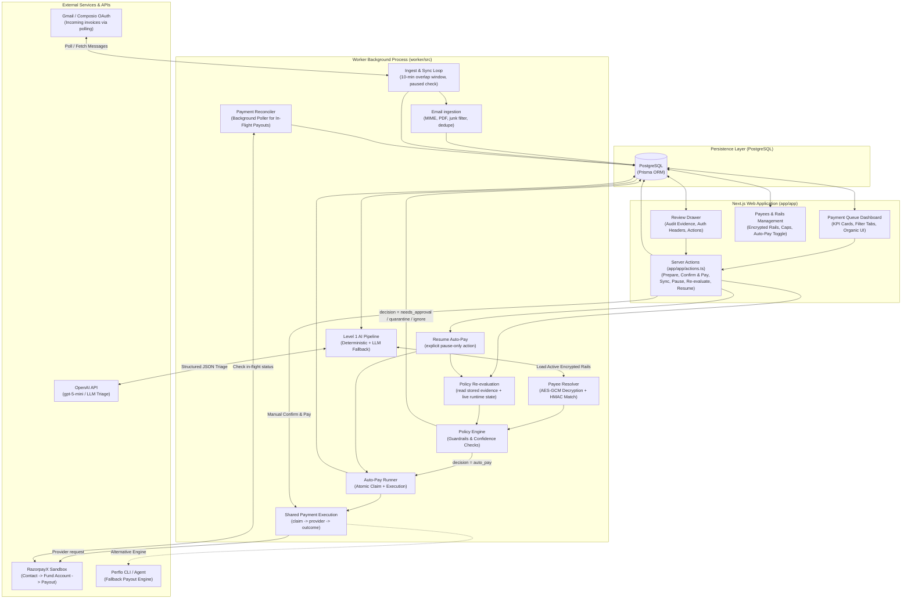
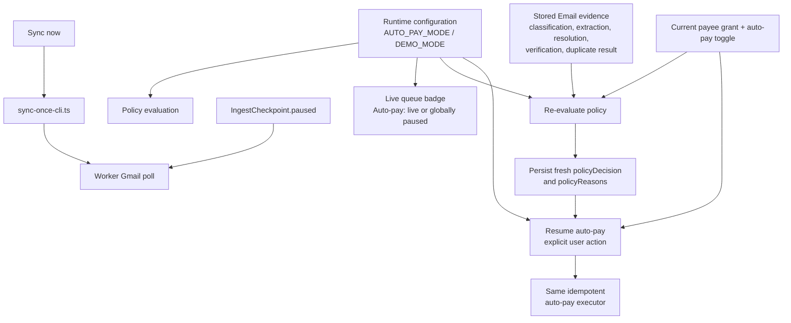
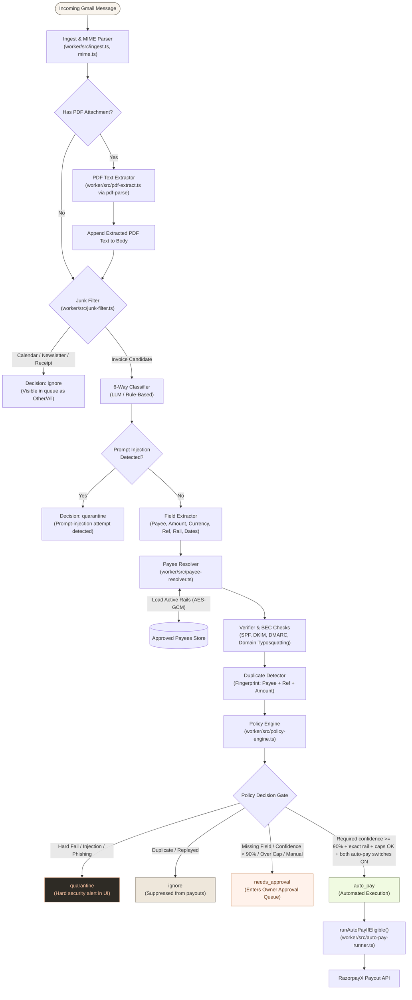
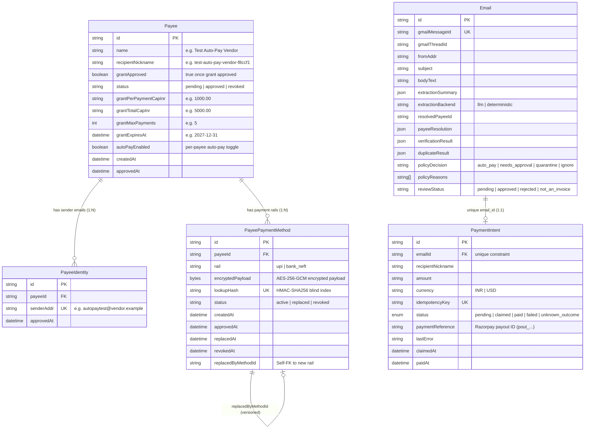
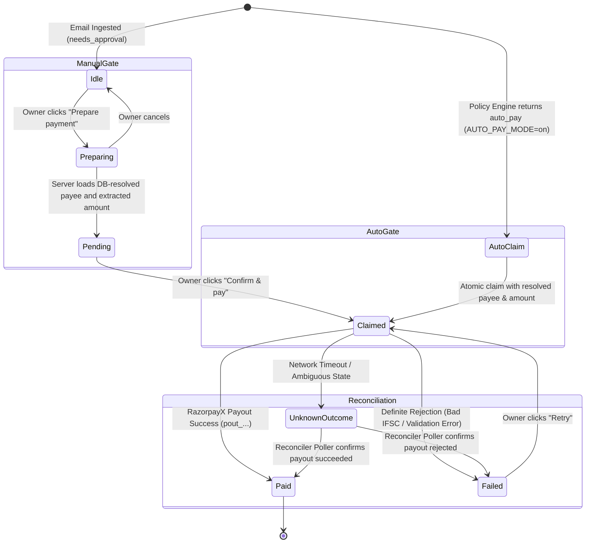

# Perflo AP Agent — System Architecture & Data Flow

This document provides the authoritative architectural specification and Mermaid diagrams representing the **current, real implementation** of the Perflo Accounts Payable (AP) Agent codebase. The older [`ARCHITECTURE_AND_PIPELINE_SPEC.md`](./ARCHITECTURE_AND_PIPELINE_SPEC.md) remains useful as a product/specification reference, but this file is the source for the architecture that exists in code now.

---

## 1. High-Level System Topology

The `Global pause is enabled` text is a runtime policy blocker recorded during the last evaluation, not a permanent property of the invoice. The dashboard reads `AUTO_PAY_MODE` live on each render; **Re-evaluate policy** refreshes an existing invoice without paying it; **Resume auto-pay** is the only explicit action that can act on invoices previously blocked solely by the global pause.

## 2. Runtime controls and queue state

These controls are intentionally separate:

- `AUTO_PAY_MODE` controls automatic money movement and is off unless explicitly set to `on`.
- `DEMO_MODE` only permits a local demo sender to match an already-registered rail; it does not enable payment.
- `IngestCheckpoint.paused` controls whether the worker fetches new Gmail messages; reconciliation can still run.
- Re-evaluation refreshes policy state but never executes a payout.

---

## 3. Ingestion & Level-1 Pipeline Data Flow

---

## 4. Payee & Encrypted Rail Architecture

Payees are modeled with a **1-to-Many relational structure** supporting multiple sender email addresses and multiple encrypted payment rails (both UPI and Bank/NEFT) per vendor.

`PaymentIntent` intentionally has no Prisma `payeeId` foreign key in the current v0 schema. It stores the resolved `recipientNickname`, while the server-side executor looks up the current approved payee and rail before sending. The payee-to-payment relationship in the runtime flow is therefore logical, not a relational foreign key.

---

## 5. Payment Execution & State Machine

Every payout adheres to a deterministic state machine whether initiated automatically or manually.

---

## 6. Security & Isolation Invariants

1. **No Blind Auto-Pay**:
   - Auto-pay is gated by **two independent switches**: a deployment-wide environment variable (`AUTO_PAY_MODE=on`) AND a per-payee toggle (`Payee.autoPayEnabled=true`).
   - Requires 100% pass on all 5 primary confidence scores ($\ge 0.90$), exact payee resolution, aligned sender auth, verifier score $\ge 80$, and grant cap compliance.
2. **Encrypted Rail Storage**:
   - Plaintext VPAs and bank accounts are never stored directly in database columns. They are encrypted with `AES-256-GCM` using `PAYEE_ENCRYPTION_KEY` and indexed with `HMAC-SHA256` using `PAYEE_HASH_KEY`.
3. **No Editable Payout Target**:
   - Payment execution binds directly to the verified database entity (`resolvedPayeeId` and approved rail) and extractor amount, never to free-form text inputs.
4. **Idempotent Payouts**:
   - Every `PaymentIntent` mints a cryptographically random `idempotencyKey` preserved across retries, preventing double-payouts.
5. **Background Process Isolation**:
   - Background email sync and payment reconciliation run in a separate worker process, keeping the Next.js web application bundle free of runtime SDK conflicts.
