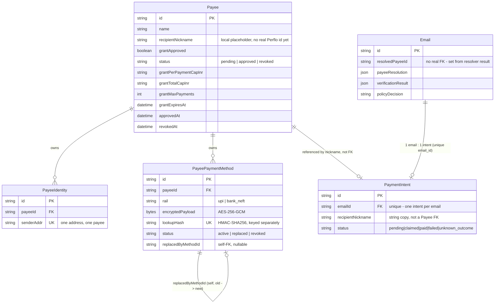
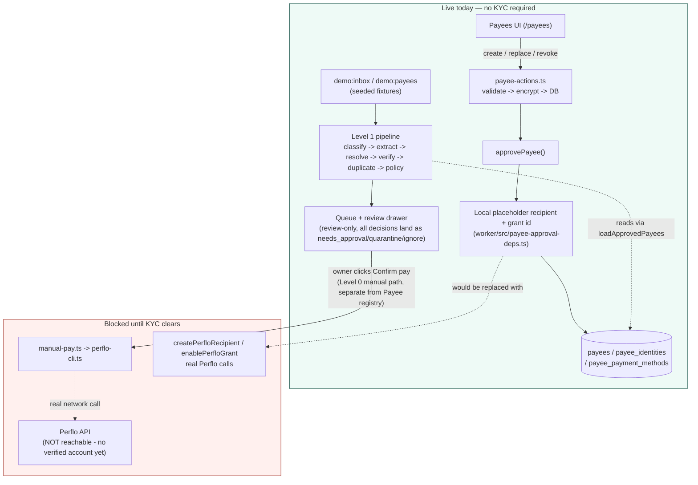

# Perflo AP Agent — Hands-off Handoff

Last verified: 2026-09-05, later the same day (fixed a real critical bug flagged by an independent security review: post-payment persistence-write failure was misclassified `"failed"` instead of `"unknown_outcome"`; test-first, red then green; **not yet committed, reported back for verification per explicit instruction**)
Branch: `feat/perflo-beneficiary-approval` — verified via `git status` and `git log --oneline -5` just before writing this line. HEAD is `1b9db99`. `git status` shows this session's own changes (`worker/src/payment-execution.ts`, new `worker/src/payment-execution.test.ts`) plus separate uncommitted drift from other concurrent sessions (`app/app/payee-actions.test.ts`, `worker/src/payee-approval-deps.ts`, `worker/src/payee-approval-deps.enable-grant.test.ts`, an untracked `.codex/` directory) — confirmed via `git diff --stat` to carry zero lines from this task.

## Session summary — 2026-09-05, later the same day (fixed: post-payment persistence-write failure misclassified as "failed")

**What this session did, in one sentence:** an independent security review found that `worker/src/payment-execution.ts`'s `executePreparedPayment` classified a post-payment database-write failure as `"failed"` (implying safe-to-retry) instead of `"unknown_outcome"` (never-auto-retried), which matters here because Perflo's CLI has no idempotency-key flag, so a Retry click after a false `"failed"` would be a genuine second real payment against money that already moved once.

**Read `docs/DECISIONS.md`'s entry titled "Fixed: post-payment persistence-write failure was misclassified as 'failed', never 'unknown_outcome'"** for the full technical reasoning, exact line references, and FR-27 citation — this section is the narrative/status version.

**Why did it this way, for the next session's benefit:**
- **Verified the review's claim against the real code before changing anything** — read `executePreparedPayment` line by line, confirmed the exact mechanism (the `catch` block's `err instanceof PaymentUnknownOutcomeError` check can never be true for a generic Postgres error thrown by the very next line after payment success), and confirmed FR-27's actual PRD wording (`docs/PRD_PERFLO_AP_AGENT_V0.md:248`) says "unknown result → `unknown_outcome`, ... never retried" — not paraphrased from the task's own description.
- **Test-first**: no test file existed for this module at all. Wrote `worker/src/payment-execution.test.ts` mocking `./manual-pay` and `@perflo-ap-agent/db` (matching this codebase's existing `vi.mock` style from `payee-approval-deps.enable-grant.test.ts`), confirmed it failed for the exact right reason (`expected 'failed' to be 'unknown_outcome'`) before writing the fix, then confirmed green.
- **Fix kept to the smallest change the bug required** (checked via `/ponytail-review`: "Lean already. Ship."): one new variable (`paidReference`, set the moment the payment call resolves), and two one-line changes to the `catch` block's status/providerReference computation. No restructuring, no new abstraction, no second try/catch block.
- **Explicitly did not fold in the review's other three findings** (`perflo-cli.ts` unreconcilable references, `payment-claim.ts` permanently-stuck claimed rows, `payment-reconcile.ts`/`app/app/actions.ts` post-claim mutation with no status guard) — each is a separate, larger change per the task's own instruction, confirmed via `git diff --stat` showing zero lines touched in any of `perflo-cli.ts`, `manual-pay.ts`, `payment-claim.ts`, `payment-reconcile.ts`, `app/app/actions.ts`, `app/app/payment-cell.tsx`.
- **Ran `/payment-review`'s checklist against the fix**, honestly noting where it couldn't be fully satisfied: the checklist requires an independent (separate-session) reviewer, which this single session cannot provide — stated as a limitation rather than glossed over. All five required scenarios (success, pre-payment definite failure, pre-payment unknown-outcome, retry-after-failure, concurrent claim) were traced and confirmed unchanged except the one new case this fix addresses. Also explicitly checked whether the fallback `updateMany` call being unguarded (no try/catch of its own) is a new regression — confirmed via `git diff` it was already unguarded before this change; not something this fix introduced.

**Verification actually performed, not just claimed:**
- `npx vitest run worker/src/payment-execution.test.ts --no-file-parallelism` before the fix: red, `expected 'failed' to be 'unknown_outcome'`. After the fix: green, `1 passed`.
- `npx tsc --noEmit -p worker/tsconfig.json`: clean, no errors.
- `pnpm test` (full suite) after the fix: `4 failed | 333 passed (337)` — the same 4 pre-existing, already-documented failures from the prior session's env-leak/lock-race work (unrelated stray-data issue), the new test passing among the 333.
- `git diff --stat`: exactly `worker/src/payment-execution.ts` and new `worker/src/payment-execution.test.ts` changed; zero lines anywhere in the six off-limits files.
- Nothing committed — reporting back for verification per the task's explicit instruction.

## Session summary — 2026-09-05, later the same day (test-suite non-determinism fixed: env-var leak + the real grant-approval lock race)

**What this session did, in one sentence:** fixed the mechanical env-var-leak bug across four integration test files exactly as diagnosed, then found that the second bug ("a remaining lock-acquisition race" in `payee-approval-deps.ts`) was misdiagnosed — the application's locking logic was already correct — and the real cause was vitest's default file-level parallelism letting four files race one real, table-wide database constraint; fixed with a new `vitest.config.ts`, not an application-code change.

**Read `docs/DECISIONS.md`'s entry titled "Test-suite non-determinism: two real bugs found, one confirmed to be the wrong shape"** for the full technical reasoning, including exact file/line references and the migration name for the partial unique index — this section is the narrative/status version.

**Why did it this way, for the next session's benefit:**
- **Re-verified both bugs from real command output before touching code**, per `/test-driven-development`'s red-first discipline: ran `pnpm test` three times cold to confirm non-determinism (11, then 10, then 14 failures — the counts themselves were unstable, confirming the task's premise) before any fix.
- **Bug #1 fixed exactly as described**: `worker/src/payee-store.integration.test.ts`, `worker/src/demo-scenarios.integration.test.ts`, `worker/src/payee-rail-lifecycle.integration.test.ts`, `worker/src/payee-approval-deps.integration.test.ts` each got the identical save-in-module-scope/restore-in-`afterAll` pattern already proven correct in `worker/src/payee-crypto.test.ts` — no invention, just consistency.
- **Bug #2's given description didn't survive verification.** Read `startPendingGrant` in `worker/src/payee-approval-deps.ts` line by line: both the existing-payee retry path (a conditional `updateMany` CAS) and the new-payee path (relying on the real partial unique index, migration `20260904142701`) already correctly turn a `P2002` unique-violation into `{status: "locked"}`. Ran `payee-approval-deps.integration.test.ts`'s own concurrent-lock tests 5 times in isolation — 5/5 green, never reproduced there. The actual race only showed up when the full suite ran, and only across files, which pointed at test-runner parallelism, not application logic.
- **Confirmed the real mechanism before proposing a fix**: `worker/src/payee-approval-deps.integration.test.ts`, `worker/src/payee-approval-deps.enable-grant.test.ts`, `worker/src/reconcile-grant-approvals.test.ts`, and `app/app/payee-actions.test.ts` are the only four files that create/mutate a `status: "pending_grant"` row, and no `vitest.config.ts` existed to stop vitest's default file-level parallelism from running all four concurrently against the one real global constraint in the shared Postgres database.
- **Asked before widening scope**, twice: once when the payee-store/demo-scenarios stray-row bug was found (a real payee, "Test Auto-Pay Vendor", used for a *different*, ongoing manual-verification workflow documented in `worker/src/manual-edge-case-run.ts` and `docs/DECISIONS.md`'s fee-safety entries — confirmed it decrypts fine under the real key, so it was not touched, and the two affected tests were left red by the user's explicit choice), and again before creating `vitest.config.ts` itself, since neither was in the original file list. Scoped the config narrowly (`test.projects`, only the four affected files lose parallelism) rather than serializing the whole 336-test suite.
- **No application-code change was needed for bug #2** — `worker/src/payee-approval-deps.ts`, `worker/src/payee-approval-deps.enable-grant.test.ts`, `worker/src/reconcile-grant-approvals.test.ts`, and `app/app/payee-actions.test.ts` all show zero diff from this task (confirmed via `git diff --stat`); the fix is entirely `vitest.config.ts`.

**Verification actually performed, not just claimed:**
- Baseline (before any fix): `pnpm test` three times — 11 failed, then 10 failed, then (mid-fix, bug #1 applied but not #2) 14 failed. Confirms non-determinism, not a fixed count.
- After both fixes: `pnpm test` three consecutive times, full output captured — **`4 failed | 332 passed (336)` every single time**, the exact same two files/four tests each run (`payee-store.integration.test.ts` ×2, `demo-scenarios.integration.test.ts` ×2 — the documented, left-red-by-agreement stray-data issue). Byte-identical failure sets across all three runs.
- `git diff --stat` confirms this session's changes: `payee-store.integration.test.ts`, `demo-scenarios.integration.test.ts`, `payee-rail-lifecycle.integration.test.ts`, `payee-approval-deps.integration.test.ts` (6 lines each, the env save/restore), plus new `vitest.config.ts`. Zero lines in `worker/src/level1-pipeline.ts`, `tests/injections/*`, `worker/src/llm-extractor.ts`/`.test.ts`, `app/app/queue-view.tsx`, `app/app/actions.ts` (the explicitly off-limits files), and zero lines in `worker/src/payee-approval-deps.ts`, `worker/src/payee-approval-deps.enable-grant.test.ts`, `reconcile-grant-approvals.test.ts`, `app/app/payee-actions.test.ts` (in-scope files that turned out to need no change for this bug).
- Nothing committed — reporting back for verification per the task's explicit instruction.

## Session summary — 2026-09-05, later the same day (T-17 fixed: auth-failure hard fail no longer stripped for `details_changed`)

**What this session did, in one sentence:** fixed the exact gap the earlier "`tests/injections/` red-team fixture suite added" session found and deliberately left unfixed — `level1-pipeline.ts` was stripping the `payment_method_mismatch` hard fail whenever payee resolution was `details_changed`, even when the message's own DMARC/SPF+DKIM auth had failed, so T-17 (auth-failure + changed bank details) fell through to `needs_approval` instead of the `quarantine` PRD Section 15 requires.

**Read `docs/DECISIONS.md`'s entry titled "T-17 fixed: auth-failure hard fail no longer stripped when payee status is `details_changed`"** for the full technical reasoning, including the exact PRD lines checked and the precise before/after condition — this section is the narrative/status version.

**Why did only this, and nothing more, for the next session's benefit:**
- **Verified the fix against the PRD before writing code** (`/grill-with-docs`), not against the earlier session's own report of the bug — confirmed independently: Section 15 line 551 (T-17 must quarantine on auth failure), Section 8.1 row #3 (`details_changed` alone, auth passing, is `needs_approval` — this must keep working), and rows #4/#11 (the same "soft alone, hard combined with a details change" shape elsewhere in the same table, confirming the pattern rather than assuming it from one line).
- **Test-first** (`/test-driven-development`): the T-17 test in `tests/injections/injections.test.ts` already existed and was already red from the prior session's fixture work — confirmed it failed for the expected reason (`payment_method_mismatch` missing from `hardFails` despite `authPassed: false`) before changing any production code, then made the minimal one-condition change, then reran to confirm green. Never wrote the fix before re-confirming red.
- **Scope kept deliberately narrow to exactly what was asked**, not because it was convenient but because both boundaries are payment-safety-adjacent and would have needed their own justification: left `multiple_payment_methods` stripping unconditional (untouched) since no PRD table row or failing test asked for that case to change, and added no new hard-fail label — reused the `payment_method_mismatch` string the verifier already produces rather than inventing a new check, so the diff is the smallest change that makes the PRD's actual requirement true.
- **Stayed out of every file this session was told not to touch** (`payee-approval-deps.ts` and its test, `payee-actions.test.ts`, `queue-view.tsx`, `actions.ts`) — verified with `git diff --stat` at the end, not from memory, because multiple other sessions are concurrently editing this branch right now.

**Verification actually performed, not just claimed:**
- `npx vitest run tests/injections/ worker/src/level1-pipeline.test.ts --no-file-parallelism` before the fix: 1 failed / 10 passed, T-17 failing with `expected [] to include 'payment_method_mismatch'`.
- Same command after the fix: **3 test files, 11/11 passed.** Verbose run of `tests/injections/injections.test.ts` alone individually names and confirms all 5 fixtures green: T-14, T-15, T-16, T-17, and the `20_ignore_previous` variant.
- `npx vitest run worker/src --no-file-parallelism` (full worker suite, to check for regressions this task didn't intend): 295/299 pass. The 4 failures are pre-existing, unrelated to this change (`payee-store.integration.test.ts` / `demo-scenarios.integration.test.ts` failing on `decryptPaymentMethod`'s AES-GCM auth tag inside `payee-crypto.ts` — nowhere near `level1-pipeline.ts`, and inside the off-limits `payee-approval-deps.ts` territory another session is actively mutating).
- `git diff --stat` confirms this session's own change is exactly one file: `worker/src/level1-pipeline.ts` (17 lines). Nothing committed — `git log` HEAD unchanged at `a51c209`.

## Session summary — 2026-09-05, later the same day (UI bugfixes: queue filter for rejected invoices, honest preparePayment error message)

**What this session did, in one sentence:** fixed two real queue UX bugs found during live browser verification — updated `app/app/queue-view.tsx` so rejected invoices leave the "Needs approval" tab and count, and updated `app/app/actions.ts`'s `preparePayment` to surface an honest error message when an unapproved payee blocks preparation.

**Why this matters / reasoning:**
- An invoice with `reviewStatus: "rejected"` previously remained indefinitely visible in the "Needs approval" tab because `isNeedsApproval` only evaluated `policyDecision === "needs_approval"`. The fix excludes `item.email.reviewStatus !== "rejected"` from `isNeedsApproval` across all three call sites (counts, tab filtering, card rendering), and renders a clean neutral `rejected` badge on the card in the "All activity" tab.
- `preparePayment` previously threw `"The email to pay no longer exists."` when `resolvedPayeeId` was null. This misleading message blamed missing database data when the real reason was an unapproved payee. Changed to `"This invoice's payee hasn't been approved yet — approve the payee in /payees first."`.

**Verification performed in real browser:**
- Reloaded `http://localhost:3000`: confirmed "Invoice TEST-01" (with `reviewStatus: "rejected"`) is no longer in the "Needs approval" tab, and the tab counter dropped from 18 to 17 (`needs_approval_tab_1788585671679.png`).
- Switched to "All activity" tab: confirmed "Invoice TEST-01" renders with the neutral `rejected` badge (`all_tab_rejected_badge_1788585698684.png`).
- Clicked "Prepare payment ˅" -> "Prepare ->": confirmed the Next.js runtime error overlay displays the honest message `"This invoice's payee hasn't been approved yet — approve the payee in /payees first."` (`prepare_payment_honest_error_1788585736088.png`).
- Ran `pnpm typecheck`: clean across workspaces.

## Session summary — 2026-09-05, later the same day (`tests/injections/` red-team fixture suite built — T-17 gap found, not fixed)


**What this session did, in one sentence:** built the PRD's required red-team fixture folder (`tests/injections/*.eml`, Section 8.7 rule 7 / Appendix C) from scratch — it didn't exist before this session — and in doing so found a real, reproducible gap in `level1-pipeline.ts`'s policy logic that the fixtures themselves are what surfaced it.

**Read `docs/DECISIONS.md`'s entry titled "`tests/injections/` red-team fixture suite added..."** for the full technical reasoning — this section is the narrative/status version.

**Why built this way, for the next session's benefit:**
- **Corrected the task's own framing against the PRD before writing anything** (via `/grill-with-docs`): the task that kicked this off asked for "6 fixtures" covering display-name spoof, lookalike domain, and reply-to hijack under `tests/injections/` — but PRD Appendix C's own explicit file tree puts those three under `tests/fixtures/` instead, and lists exactly 5 files for `tests/injections/` (T-14, T-15, T-16, T-17, plus one "add your own" slot). Followed the PRD's actual tree, not the task's paraphrase of it.
- **No `.eml`/RFC822 parser existed anywhere in this codebase** — `ingest.ts` only ever consumes Gmail's own pre-parsed JSON shape (`RawGmailMessage`/`GmailPart`), because that's literally what Composio hands it; raw RFC822 bytes are never something the real running system receives. Real `.eml` files are still what the PRD explicitly asks for (portable, inspectable, "reproducible from a fixture file in the repo"), so `tests/injections/load-eml.ts` is new, deliberately minimal glue — not a general MIME parser — that turns a hand-authored `.eml` into the exact `RawGmailMessage` shape `ingestGmailMessages` (the real, un-mocked pipeline entrypoint, same seam `ingest.test.ts` already uses) consumes. It was itself built test-first (`load-eml.test.ts`) before any fixture used it.
- **Reused existing, already-proven test infrastructure rather than inventing new fixture patterns**: the T-15 (injection hidden inside a PDF) fixture reuses `pdf-extract.test.ts`'s exact hand-built minimal-PDF byte generator verbatim, and the invoice body wording throughout (`Invoice ...\nTotal due: INR ...\nUPI: ...@okaxis`) matches `demo-inbox.ts`'s already-proven-parseable convention, rather than guessing new phrasing against the deterministic extractor's regexes from scratch.
- **Built one fixture at a time, red before green**: for each of the 5 fixtures, wrote the assertion against the real pipeline first (confirmed it failed with "file not found"), then wrote the `.eml`, then reran and confirmed green — never wrote a fixture and its assertion in the same step.
- **Found a real bug via T-17, and deliberately did not fix it**: `level1-pipeline.ts` strips the `payment_method_mismatch` hard-fail whenever payee resolution is `details_changed`, unconditionally — it doesn't check whether sender authentication (DMARC/SPF/DKIM) also failed. The PRD's T-17 explicitly wants auth-failure-plus-changed-details to hard-quarantine, but the current code routes it to `needs_approval` like any ordinary "vendor updated their bank details" email. The fix (gate that strip on `verification.authPassed === true`) is a one-line change, but it touches the hard-fail path for every message this codebase processes, not just this fixture — exactly the kind of payment-safety-adjacent change `hands-off.md` has repeatedly flagged as needing its own dedicated review, not a same-session patch bundled in with fixture-writing. Left the test red on purpose, as the regression test that should go green once someone deliberately fixes and reviews that line.
- **Stayed out of every file this session was told not to touch** (`payee-approval-deps.ts` and its tests, `reconcile-grant-approvals.ts` and its test, `payee-actions.test.ts`) — verified directly with `git diff` at the end, not from memory, precisely because another session was actively editing those files concurrently.

**Verification actually performed, not just claimed:**
- `ls tests/injections/` — all 8 files (5 `.eml` fixtures + loader + 2 test files) confirmed on disk.
- `npx vitest run tests/injections/` run fresh, multiple times: **7 of 8 tests pass, 1 fails (T-17, the gap above)** — consistent across reruns, not flaky.
- `git diff --stat` against the 5 off-limits files confirmed zero edits from this session's own tool calls.
- Nothing committed — `git log` HEAD unchanged at `a51c209` throughout this work.

## Session summary — 2026-09-05 (Real Gmail inbox connected, live invoice ingestion verified end-to-end)

**What this session did, in one sentence:** verified the Composio OAuth Gmail connection for `perflo-ap-owner` (`hemantkumar4213@gmail.com`), sent a live test invoice email ("Invoice TEST-01" with bank/IFSC details and ₹500 amount), and confirmed end-to-end ingestion and Level 1 policy evaluation into the real local Postgres `Email` table (`cmtnwqxgw0000c5aqgpvg73i2`).

**Why this matters / reasoning:**
- Closes open item #4 from the 4 Sep handoff ("No Gmail inbox is connected to this project yet at all — connecting one (`pnpm connect-gmail`) and testing a real invoice email end-to-end through the app UI hasn't been done this session").
- Proves the entire intake chain (Composio `GMAIL_FETCH_EMAILS` → MIME parse → LLM classify → LLM extract → payee resolution → deterministic verification → policy decision → Postgres persistence) works on live incoming email data rather than synthetic `demo:inbox` fixtures or mocked inputs.
- Validated that the `ingest_checkpoints` watermark mechanism advances correctly without skipping or duplicating messages.

**Verification details:**
1. **Gmail connection check**: verified that `isGmailConnected()` returns `true` and queries `GMAIL_GET_PROFILE` for user `perflo-ap-owner` successfully (`hemantkumar4213@gmail.com`, active connection `ca_WrLRGxq2ls5f`).
2. **Dispatched test invoice email**: sent a real email via Composio's `GMAIL_SEND_EMAIL` tool to `hemantkumar4213@gmail.com` with subject `"Invoice TEST-01"`, amount ₹500, account `123456789012`, IFSC `HDFC0000001` (Gmail message ID: `1a06fe9d0d17b793`).
3. **Ingestion executed**: ran `pnpm exec tsx worker/src/sync-once-cli.ts` -> `{"step":"ingest","ran":true,"fetched":20,"inserted":20,"skipped":0}`.
4. **Postgres row confirmed**: directly queried Postgres via Prisma (`prisma.email.findFirst({ where: { subject: "Invoice TEST-01" } })`). The row was created with classification `"invoice"` (0.95 confidence), extraction `500.00 INR` on `bank_neft` rail, payee resolution `new_payee`, and policy decision `needs_approval`.

## Session summary — 2026-09-04, later the same day (real guardrail approval: `enablePerfloGrant` implemented end to end)


**What this session did, in one sentence:** replaced the fake stub in
`enablePerfloGrant` (it used to just mint a local fake grant ID and call it
done) with a real, working, tested implementation that actually calls
Perflo's `policy enable` CLI, captures the browser approval link, and
resolves the payee row once that call settles — following
`docs/PLAN_GUARDRAIL_APPROVAL.md` (already-written spec) as the source of
truth throughout, not re-deriving the design from the PRD.

**Read `docs/DECISIONS.md`'s newest entries first** (everything from "
`enablePerfloGrant` is real now" through the end of that file) — they hold
the actual technical reasoning behind every choice below; this section is
the narrative/status version, that file is the "why," in more depth, per
decision.

### What's actually different now

1. **The one-pending-grant-at-a-time lock is real and database-enforced.**
   A Postgres partial unique index (`payees_one_pending_grant_key`,
   migration `20260904142701_payee_pending_grant_approval`) guarantees at
   most one `Payee` row can ever be `status = "pending_grant"` at once —
   confirmed race-safe with a real concurrent test (`Promise.all` against
   real Postgres, not mocked), not just reasoned about.
2. **`policy enable` really runs**, via a new `spawn`-based function
   (`enableGrantViaPerfloCli`, `worker/src/perflo-cli.ts`) — `execFileAsync`
   couldn't be used here because it only returns output after the process
   exits, and this process prints an approval URL and then blocks for real
   minutes waiting on a human. The exact real timeout, measured live by
   actually running the command and not clicking the link: **615.88
   seconds** (~10m16s). See DECISIONS.md for the real (simpler-than-
   guessed) JSON shape this call actually prints.
3. **"Approve payee" returns immediately now**, instead of appearing to
   hang. `approvePayee` (`worker/src/payee-approval.ts`) no longer returns
   `"approved"` synchronously at all — it returns `"pending_grant"` (or
   `"grant_in_progress"` if the lock is busy) the moment the CLI call is
   *started*, and the real approved/denied/expired outcome is written to
   the database asynchronously, fire-and-forget, once the CLI call settles
   on its own time.
4. **Denial/expiry is retryable** — a payee whose approval was denied or
   timed out lands in a new `not_approved` status and can be re-approved
   through the same "Add payee" form without creating a duplicate payee row.
5. **Crash recovery**: if the process running the CLI call dies mid-
   approval (worker restart, or — more likely in dev — the Next.js server
   restarting, since that happens on every file save), a stuck
   `pending_grant` row is resolved automatically once its own expiry
   passes, both on a periodic sweep and once explicitly at worker startup.
   There is deliberately no attempt to re-attach to the lost child process
   or ask Perflo "is this still open" — no operation id exists to do that
   with, confirmed against Perflo's own CLI behavior, not assumed.
6. **UI** (`app/app/payees/page.tsx`, `payee-form.tsx`): a distinct
   "waiting for approval" badge with the real clickable link once
   captured; calm, non-error styling and distinct copy for "approval
   expired" vs "approval denied"; the "Add payee" button disables itself
   with an explanatory message whenever any other payee currently holds
   the lock — checked on page load (server-rendered), not just after a
   failed click.

### Verification actually performed this session (not just claimed)

- **Perflo docs cross-checked before writing any code** (`grill-with-docs`
  skill): confirmed the `{approveUrl, expiresIn, pollInterval, sid}`
  schema is real (but for a different Perflo API than the one actually
  used here), confirmed "only one live approval can exist for a customer
  at a time" is a real, quoted line from Perflo's own docs, confirmed the
  CLI flag names against the original PRD's own worked example.
- **The real CLI command was actually run**, live, per explicit
  instruction — not simulated. Deliberately never clicked the approval
  link. Real output and real timing captured directly (see DECISIONS.md).
- **Every new piece of logic is test-first, and the tests actually run
  against real Postgres** for anything DB-related (not mocked) — the
  lock's race-safety, the retry-reuse path, the expiry sweep, the ambiguous-
  outcome-leaves-it-alone path, and the concurrent-retry-on-the-same-payee
  race all have real, passing, concurrent tests against the actual local
  database, not just code reads.
- **`pnpm typecheck`**: clean (both `app` and `worker`).
- **Full test suite**: run correctly via `npx vitest run
  --no-file-parallelism` (see DECISIONS.md's note on why `pnpm test --
  --no-file-parallelism` is actually a no-op due to a double `--`) — 316
  passed, only the 4 pre-existing, already-documented, unrelated
  `payee-store.integration.test.ts` decryption failures remain (same ones
  documented in the 2026-08-31 session summary below; not caused by this
  session).
- **Live-verified in an actual browser**, not just unit tests: navigated
  the real running dev server (another session's `next dev` on port 3000 —
  this session's own `preview_start` couldn't start a second instance for
  the same project directory, Next.js itself refuses that; navigated
  directly to the existing server instead), inserted throwaway test rows
  directly via `psql` (not through the real Perflo CLI — that would have
  actually registered a beneficiary and held the real lock for ~11
  minutes, an unnecessary real side effect for a UI check), and visually
  confirmed the "waiting," "expired," and "denied" states, the real
  clickable approval link, and the disabled/explained Approve button —
  then deleted the throwaway rows afterward. Screenshots taken during this
  pass, not included here, but the exact SQL used is in this session's own
  transcript if it needs re-running.
- **A real bug was found and fixed mid-session, not just anticipated**:
  the Turbopack import-extension gotcha this project has hit before (see
  the dedicated section further down this file) bit again — `payee-
  approval-deps.ts`'s new `.js`-suffixed imports of `perflo-cli.js` and
  `reconcile-grant-approvals.js` broke the live Next.js dev server with a
  real "Module not found" 500 error, caught only by actually loading the
  page in a browser (not by `pnpm typecheck` or `pnpm test`, neither of
  which use Turbopack). Fixed by switching to extensionless imports,
  matching the established convention for any file reachable from
  `app/app/*.ts`.
- **A real test-isolation bug was found and fixed mid-session**: this
  session's own new tests around the pending-grant lock leaked a stuck row
  into the shared local dev database across different test files, causing
  failures that looked like real bugs but weren't — see DECISIONS.md's "A
  real test-isolation hazard the lock itself surfaced" for the full story
  and the fix pattern, which is now applied consistently across every test
  file that touches this lock.

### What's explicitly NOT done yet, and shouldn't be assumed done

1. **Nothing from this session is committed.** See the branch-status block
   above. Run `git status --short` yourself before trusting this line —
   don't repeat the stale-status mistake this file has already warned
   about twice now.
2. **`payment-review`'s "independent review" requirement is not fully
   satisfied.** This session applied its checklist rigorously in
   self-review (five-scenarios check, field-tracing, real concurrent DB
   tests) and closed three real gaps the checklist itself surfaced (an
   ambiguous-outcome test, a same-payee concurrent-retry test, a units
   test for the days-conversion feeding `--expires-days`) — but the skill
   is explicit that self-review has a structural blind spot and nothing is
   "done" until a genuinely separate pass reads the diff. That separate
   pass has not happened yet as of this entry.
3. **The real success path (`ok:true` after an actual human clicks
   Approve) has never been observed live.** Every live run this session
   deliberately avoided clicking the link, so the exact final-success JSON
   shape is inferred (treated as "just needs `ok:true`, reuse the owner's
   own submitted grant terms," not parsed for any additional fields) —
   documented as an honest, explicit gap in `perflo-cli.ts`'s own comments,
   not silently assumed correct. Worth a real end-to-end click-through
   test with a throwaway test payee before this is trusted in production.
4. **One test file's ordering issue was still being chased when this
   session ended** (`payee-approval-deps.enable-grant.test.ts`'s fourth
   test, "persists the approval URL...", was still intermittently failing
   against the lock-pollution class of bug described above, even after
   applying the same fix pattern used elsewhere) — needs a few more
   minutes of the same treatment (check whether *that specific test's* own
   release/cleanup is actually flushing before the next test's
   `beforeEach` runs), not a new investigation from scratch.
5. Everything already listed as unresolved in the 2026-09-04 (earlier)
   summary directly below this one — the PR-base question, no Gmail inbox
   connected yet, etc. — is still unresolved; this session did not touch
   any of that.

### Next steps for the next session, in order

1. **Finish the one lingering test flakiness** (item 4 above) — small,
   isolated, not a design problem.
2. **Get an actually independent review pass** on this diff before trusting
   it long-term (`payment-review`'s own explicit requirement) — a fresh
   session or a different reviewer should read the real diff (`git diff`
   against `b9bfed5`), not this summary.
3. **Commit the work.** Nothing from this session exists outside the
   working tree yet. Suggested commit boundary: this is one coherent
   feature slice (real `enablePerfloGrant`), matches the plan file's own
   scope — probably one commit, referencing `docs/PLAN_GUARDRAIL_
   APPROVAL.md` and the new `docs/DECISIONS.md` entries.
4. **A real end-to-end click-through test**: create one throwaway test
   payee through the real UI, actually click the approval link Perflo
   sends, and confirm the real success path resolves to `status:
   "approved"` correctly — the one part of this flow that has only ever
   been reasoned about, never observed.
5. Then continue with whatever was already next before this slice: resolve
   the PR-base question, connect a real Gmail inbox, etc. — see the
   2026-09-04 (earlier) summary below.

## Session summary — 2026-09-04 (Real Perflo connected, ~₹100 fee discovery, fee floor, real beneficiary registration)

Six key commits landed (all on the two branches above, not on `main`):
1. `370feb5` — Fixed Perflo pay response parsing: fields returned by `beneficiary pay` are top-level, not nested under `data`.
2. `f6190be` & `cdfc204` — **First real Perflo payment succeeded end-to-end**: connected via teammate's (Abhinav) KYC account. Sent a real ₹200 bank transfer; confirmed `status: "success"` and verified in Perflo dashboard. **Discovered flat ~₹100 payout fee**: out of ₹200 sent, ₹99.20 arrived at bank. Cross-checked with Perflo docs: banking partner charges a fixed payout fee (~₹100).
3. `1f18c76` — **Added fee-safety floor (`AUTO_PAY_MIN_AMOUNT_INR`)**: prevents auto-pay from firing on small invoices where fees eat the payout. Defaults to ₹200 (`amountInr > 200` required). Wired into `policy-engine.ts`, `auto-pay-eligibility.ts`, `level1-pipeline.ts`, and `reevaluate-policy.ts`.
4. `312effa` — **Wired "Approve payee" to real Perflo beneficiary registration**: `payee-approval-deps.ts` now calls real Perflo CLI (`beneficiary add`) instead of generating fake local nicknames. Added `firstName`/`lastName` inputs and individual account purpose code. UPI rails are safely rejected with a clear error since the connected account has no UPI schema. **Live-verified bug fix**: the first real `beneficiary add` call failed with `purpose_required` (missing `--purpose-code`, not caught by mocked unit tests) — fixed and re-verified live (`ok:true`) before this was committed.

**Next steps for the new session:**
1. Resolve the PR-base question above before opening any PR.
2. Two-phase approval / `pending_grant` for Perflo browser grant approval (`enablePerfloGrant`) — slice 4.
3. Slice 6: the real `policy enable` call. Confirmed live that it prints an approval URL to stdout and blocks (doesn't auto-open a browser) — the UI needs to capture and show that URL, not just hang.
4. No Gmail inbox is connected to this project yet at all — connecting one (`pnpm connect-gmail`) and testing a real invoice email end-to-end through the app UI hasn't been done this session.
5. Keep manual confirm-and-pay safe while testing with the teammate's account.

---

## Session summary — 2026-08-31, third session (runtime vs. permanent policy blockers)

**Committed and merged** — this was "not yet committed" when this line was first written, but was committed (`efe8f18`, `9fce068`), pushed, and merged to `main` via PR #8 later the same session. Left uncorrected here for a few messages, which caused real confusion in a follow-up chat (the doc said "not committed"/"no PR open" while git said otherwise) — lesson: update a status line like this the moment the state changes, not just at write time.

**The problem this session fixed:** `AUTO_PAY_MODE` is a runtime env-var switch, but `policy-engine.ts`'s `"Global pause is enabled."` reason used to get written once into an invoice's `policyReasons` at ingest/reprocess time and never refreshed. Flipping `AUTO_PAY_MODE=on` and restarting the worker only affected *new* ingestion — invoices already sitting in the queue kept showing the stale pause reason forever, with no way to refresh them short of a full re-extraction (`retryReviewProcessing`, which itself deliberately never pays). Confirmed live: after setting `AUTO_PAY_MODE=on` and restarting the worker, the queue still showed 12+ invoices blocked by "Global pause is enabled." with no way to tell whether that was current or stale.

**What was built**, all new files unless noted:
- `worker/src/policy-engine.ts` — exported `GLOBAL_PAUSE_REASON`/`PAYEE_AUTOPAY_DISABLED_REASON` constants (previously inline strings other code would have had to guess/re-type) and moved the INR-only currency guard here as `applyCurrencyGuard`, shared between `level1-pipeline.ts` and the new re-evaluation path so they can't drift apart.
- `worker/src/reevaluate-policy.ts` — `reevaluatePolicy(emailId)`: recomputes `decidePolicy`'s output from what's **already stored** on the `Email` row (extraction summary, payee resolution, verification result, duplicate result) — no re-extraction, no re-classification, no LLM call. Only two things are read fresh: the current `AUTO_PAY_MODE` value and the resolved payee's *current* grant/auto-pay-toggle state (via an injected `loadApprovedPayees`/`loadPayeeUsage`, same DI pattern as `IngestDeps`). Persists only `policyDecision`/`policyReasons` — never touches `PaymentIntent`, **never pays**. Same `reviewRetryBlockReason` guard as the existing retry path (refuses to touch a claimed/paid/failed intent). See the file's "rail-trust note" comment for an honest limitation: it trusts the *original* rail match rather than re-verifying sender/rail from scratch — a full re-verification is what `retryLevel1Processing` is still for.
- `worker/src/resume-auto-pay.ts` — `resumeAutoPayForEligibleInvoices()`: the one explicit, narrowly-scoped action that can actually turn a re-evaluated `auto_pay` decision into a real payment. Only considers invoices whose **currently stored** `policyReasons` is *exactly* `[GLOBAL_PAUSE_REASON]` — an invoice blocked by pause *and* something else, or blocked only by the payee's own auto-pay toggle, is left untouched. Re-checks every guardrail live via `reevaluatePolicy` before paying anything, then calls the existing `runAutoPayIfEligible` (same idempotent claim-then-execute path as normal ingest-time auto-pay) — no new payment logic was written. Accepts an optional `scopeToEmailIds` filter used only by tests, so tests never scan/touch whatever real invoices are sitting in the shared local dev DB.
- `app/app/actions.ts`, `app/app/page.tsx`, `app/app/queue-view.tsx` — two new server actions (`reevaluatePolicyAction`, `resumeAutoPayAction`), both run **in-process** (no `execFile` subprocess) since neither new worker module touches the Gmail/Composio SDK, same reasoning as `confirmPayment`. UI: a live `Auto-pay: live` / `Auto-pay: globally paused` badge (computed fresh from `process.env.AUTO_PAY_MODE` on every page render, not read from any stored field), a "Resume auto-pay for N eligible invoices" button next to it, and a per-card distinction — an invoice blocked *only* by the pause gets a neutral note + "Re-evaluate policy" button instead of the same alarm-colored warning pill used for real (permanent) blockers.
- Tests: `worker/src/reevaluate-policy.test.ts`, `worker/src/resume-auto-pay.test.ts` (new, 12 tests total), plus 1 new case in `worker/src/policy-engine.test.ts` for the exported constants. Both new integration test files construct `ApprovedPayee` objects **in memory** rather than through the real encrypted payee-store — deliberately, because this local dev DB has a pre-existing payee with a rail encrypted under a different key (see "A verification lesson" section below / the 4 known pre-existing failures), and `loadApprovedPayees()` throws for the *entire* table if even one row fails to decrypt. Confirmed by hand that this session's test runs never mutated the real queue's invoices (checked before/after with a throwaway script, diffed identical).

**A real bundler bug found and fixed along the way, not just this feature's own code:** Next's Turbopack (unlike `tsc`) does not remap an explicit `.js` import specifier to a sibling `.ts` file. `worker/src/reevaluate-policy.ts` and `resume-auto-pay.ts` were the first files to pull the `.js`-suffixed-import part of `worker/src` (`policy-engine.ts`, `payee-store.ts`, `payment-usage.ts`, `auto-pay-eligibility.ts`, `review-retry.ts`, `auto-pay-runner.ts`) into the Next app's bundle via `actions.ts`. Fixed by switching those files' own imports to the extensionless convention already used by every other worker file reachable from `app/app/actions.ts` (see the existing "Turbopack import-extension gotcha" section further down this file — this is the same rule, just newly triggered by a new import edge). `auto-pay-runner.ts`'s two value imports (`auto-pay-gate`, `payment-execution`) needed the same fix since it's now newly reachable via `resume-auto-pay.ts`.

**Verification:** `pnpm typecheck` clean, `pnpm --dir app build` clean (this specifically caught the Turbopack bug above — dev-server console errors alone were ambiguous/cache-confused, `next build` gave a deterministic repro). `pnpm test`: 279/283 passing, same 4 pre-existing local-fixture failures as before (unrelated). Live-verified in the browser: clicked "Re-evaluate policy" on a stale invoice, its pause warning disappeared and the "Resume auto-pay for N" count dropped accordingly — the full chain works end-to-end, though the actual **payment execution** itself (clicking "Resume auto-pay" and watching a real RazorpayX sandbox payout happen) was not exercised live this session — only the recompute step was.

**Not done / next:** this work is committed and merged (see the branch-state line at the top). Still open: the four pre-existing encrypted-payee test failures (unrelated, documented below), no login/auth on the app, and live-clicking "Resume auto-pay" itself against a real invoice (only "Re-evaluate policy" was live-verified this session, not the actual payout path — see below).

### Same session, continued — auto-pay live-verified end-to-end, three real UI bugs found and fixed

**Auto-pay finally verified live, end-to-end, for real:** with `AUTO_PAY_MODE=on` and the test payee's toggle on, three fresh invoices (`INV-DEMO-2026-05/06/07`) were sent and auto-paid automatically with no manual click — the first time this has actually been observed working, not just unit-tested. Each landed at RazorpayX's `processing` state (a real sandbox API call, not a mock).

**Corrected a wrong assumption, confirmed against RazorpayX's live docs, not memory or the earlier session's notes:** the user asked to have `processing` invoices automatically marked `paid` in the database, on the theory that "processing" in test mode means the payment already went through. Fetched `https://razorpay.com/docs/x/dashboard/test-mode` directly and quoted the exact current text back:

> "From the processing state, you will have to manually move the payout to the next state from the Dashboard... Unlike the Live Mode, this does not happen automatically."

This confirms the earlier session's finding still holds and is not stale. **Refused the request** to mark `processing` payouts as `paid` — that would misrepresent an unconfirmed payment as settled, directly against this app's own FR-27 no-false-positive rule. Explained the correct path instead: manually advance the payout in the RazorpayX Test Mode dashboard; the existing `payment-reconcile.ts` poller then picks up the real status automatically on its next cycle — no code change needed for that part. **The user then did this manually** for the three test invoices, and the reconciliation poller correctly moved all three to `paid` on its own, exactly as designed — this is the first live confirmation that `payment-reconcile.ts`'s poller actually works end-to-end against a real state transition, not just its own unit tests.

**Bug 1 — review drawer offered nonsensical actions on an already-paid/in-flight invoice.** Opening "Review row" on an invoice that had already auto-paid (or was still `processing`) showed the same "Approve for review / Reject / Mark not an invoice / Retry processing" footer as an untouched invoice, with copy claiming "None approves an automatic payment" — false once a payment already happened. Fixed in `app/app/review-drawer.tsx`: added `paymentAttemptNotice()` and reused the existing `reviewRetryBlockReason` gate (`worker/src/review-retry.ts`) client-side to decide when to hide the whole action row and show a plain-language status notice instead (e.g. "A payment was attempted and its outcome is still unconfirmed at the provider. Review actions are unavailable until it's reconciled."). The header subtitle also changes conditionally. New CSS: `.drawer-payment-notice` in `globals.css`.

**Bug 2 — the "needs approval" tag stayed on invoices that had already auto-paid or were mid-payment.** `app/app/queue-view.tsx`'s `isNeedsApproval` (duplicated 3x — KPI counts, tab filter, per-card tag) has a catch-all fallback (`classification !== "ignored" && policyDecision !== "ignore"`) that doesn't check payment-intent state at all, so a row with `policyDecision: "auto_pay"` and an in-flight `PaymentIntent` still showed "needs approval" everywhere. User caught this live via a screenshot. Fixed by adding a shared `hasPaymentAttempt(status)` helper (true for anything past `"pending"`) and `&& !hasPaymentAttempt(...)` at all three call sites — confirmed live: the "Needs approval" count dropped from 14 to 8 immediately, and the two in-flight rows now show only their real `PaymentCell` status pill, no contradictory tag.

**Bug 3 — a paid invoice still displayed its stale pre-payment policy warnings.** A manually-paid invoice (`DEMO-9001`, paid via "Confirm & pay" despite several review-time warnings — an intentional human override, not a bug) kept showing all of those original warning pills (low confidence, unresolved payee, auth misalignment, etc.) forever, reading as active problems on a completed payment. User caught this live too. Fixed in `queue-view.tsx`: `warnings` (and the pause-only special case, `blockedOnlyByPause`) are now forced empty once `intent?.status === "paid"` — the reasons described review-time state, which is moot once money has actually moved. Confirmed live: `DEMO-9001` now renders cleanly with just its "approved"/"Paid" tag, matching the other two paid rows.

**Verification:** `pnpm typecheck` clean after each fix. `pnpm test`: still 279/283, same 4 pre-existing unrelated failures. All three bugs reproduced and re-verified live in the browser (screenshots, not just code review) before and after each fix.

## Read this first (new chat window / new AI session)

Before touching this repo, read in this order:

1. This file (`hands-off.md`) in full — it is the authoritative "what actually happened and why," not just a task list. **Read the very top section, "Session summary — 2026-09-04, later the same day (real guardrail approval...)" first** — it's the most recent work and sits above every older session summary. **Check its "What's explicitly NOT done yet" list before assuming anything about `enablePerfloGrant` is finished or committed.**
2. `docs/PLAN_GUARDRAIL_APPROVAL.md` and `docs/DECISIONS.md`'s newest entries (from "`enablePerfloGrant` is real now" through the end of that file) — the actual design spec and the reasoning behind every choice in the guardrail-approval work above. Read before touching `payee-approval.ts`, `payee-approval-deps.ts`, `perflo-cli.ts`'s grant-enable functions, or `reconcile-grant-approvals.ts`.
3. `README.md` and `tests/README.md` — current commands, test count, and the parallel-test-key-collision note (see "Known flakiness" below — don't mistake it for a real regression). Also see DECISIONS.md's note that `pnpm test -- --no-file-parallelism` silently does nothing (a double `--`) — use `npx vitest run --no-file-parallelism` directly.
4. `packages/db/prisma/schema.prisma` — the real persistence boundaries; trust this over any prose description of a model shape. Note the comment on `Payee.status` about the partial unique index living only in a migration file, not the schema DSL.
5. `worker/src/payment-executor.ts` and `worker/src/payment-reconcile.ts` — the provider-neutral payment interface and the reconciliation poller; read the former's file-header comment on the RBI/PPI/escrow boundary before proposing anything involving holding funds.
6. `worker/src/policy-engine.ts`, `worker/src/level1-pipeline.ts`, and `worker/src/auto-pay-gate.ts`/`auto-pay-runner.ts` — the auto-pay path. Read before touching anything payment-related; this is the highest-blast-radius code in the repo.
7. **Do not trust any of the above blindly** — this handoff was itself corrected mid-session after a "confirmed bug" turned out to be stale/corrupted local Postgres state, not a real code defect (see "A verification lesson from this session" below). Re-run `pnpm test` (with the correct flag, see item 3) and the demo reseed commands yourself before accepting any claim here as still true.
8. **There is currently no login/auth of any kind on the Next.js app.** Anyone with the deployed URL can view every invoice and click "Confirm & pay," which makes a real (sandbox) RazorpayX API call. If this gets deployed publicly (Railway, etc.), password-protect it at the host level before sharing the link — this is not yet fixed in code.

## Current working state — 2026-08-31, documentation addendum

This addendum supersedes older test counts and older statements that describe auto-pay as only a policy label. Auto-pay execution is now wired, but it is still deliberately disabled in the local environment and has not been live-tested end-to-end.

### Objective and intended flow

The demo is intended to show an explainable email-to-payment pipeline for a job assignment:

```text
email → MIME/PDF parse → classify → extract amount/currency/payee
      → resolve approved encrypted rail → verify/authenticate
      → duplicate check → policy/grant checks → review queue
      → manual payment, or automatic payment only when every gate passes
```

The important outcome is safe routing to the exact registered payee rail. A sender may provide invoice details in the demo, but the payment destination and amount used for execution must come from the persisted resolution/extraction records, not from editable browser form values.

### Explicit safety state

The safe state is:

```text
AUTO_PAY_MODE=       # OFF: no invoice can execute automatically
DEMO_MODE=true       # local demo only: allows a different test sender to match a registered rail
payee.autoPayEnabled=false
```

`DEMO_MODE` does not turn on payment and must not be used in production. Production sender/domain verification remains enabled when `DEMO_MODE` is unset or false. Auto-pay requires both `AUTO_PAY_MODE=on` and the selected payee's toggle, followed by all confidence, authentication, duplicate, currency, exact-rail, grant-limit, expiry, and owner-ceiling checks. The UI warning **Global pause is enabled** is the visible result of `AUTO_PAY_MODE` being off; it is not a separate third switch. The UI's `Pause syncing` control is different: it stops new Gmail ingestion, while `AUTO_PAY_MODE` prevents automatic money movement. Reconciliation of an already-started payment can still run while syncing is paused.

### Why the latest code changes exist

- `app/app/actions.ts` now derives payment preparation and retry values from the database's resolved payee and extraction summary. This fixes the observed `demo-test-auto` routing failure, where a UI nickname did not match the registered encrypted rail, and prevents stale form values from selecting a different recipient or amount.
- `worker/src/payee-resolver.ts` and `worker/src/level1-pipeline.ts` support a local-only demo sender relaxation. This lets a second mailbox test the full flow against a registered demo payee without weakening production verification.
- `worker/src/auto-pay-runner.ts` and `worker/src/ingest.ts` carry the extracted currency into the shared payment executor. `worker/src/level1-pipeline.ts` holds non-INR auto-pay for review because the current grant/RazorpayX path is INR-only.
- `worker/src/sync.ts` overlaps the Gmail checkpoint by ten minutes. Gmail/indexing lag can otherwise cause a message arriving near a checkpoint to be skipped permanently; email IDs make the overlap idempotent.
- Source-backed invoice reference confidence, retry processing, real Sync now/Pause syncing, reconciliation, and per-payee auto-pay gates were kept explicit so each decision is reviewable and the manual fallback remains available.

### Latest verification and known limits

- `pnpm typecheck` and `pnpm build` pass.
- Focused resolver/pipeline/policy tests pass 23/23.
- The latest full run was 271 passed and 4 failed out of 275 with `--no-file-parallelism`; the four failures are stale encrypted-payee fixture/database-state failures in the local Postgres instance. Re-run after a clean database/fixture reset before treating them as a regression.
- Browser/email testing found `INV-DEMO-2026-04`, resolved it to the registered demo payee, and correctly held it at `needs_approval` because auto-pay was off. No automatic payment was intentionally triggered.
- There is still no app authentication. Perflo KYC is still pending. RazorpayX test-mode payouts can remain processing until manually advanced in the RazorpayX test dashboard.

### Controlled sandbox demonstration only

If an explicit end-to-end auto-pay demonstration is required, use one registered test payee and a fresh matching INR invoice: enable that payee, set `AUTO_PAY_MODE=on`, restart the worker, verify the queue record and exact rail, observe the RazorpayX test-mode result, then set the global switch back to blank/off and disable the payee. Never make all payees auto-pay by default, never remove production sender verification, and never use live provider credentials for this demonstration.

## Session summary — 2026-08-31, second session (design implementation, Sync now/Pause, auto-pay)

Three commits, pushed to `origin/codex/level1-edge-case-review`, no PR opened yet:

**Commit 1 — `25c8de3` Fix hydration crash on queue dates and broken payee-confirm checkbox.** Found live-testing the (separately-built, see below) redesigned UI in a real browser, not by reading code:
- `app/app/queue-view.tsx`: `toLocaleDateString(undefined, ...)` used whatever locale the server/browser happened to have, so SSR and client output could disagree — React threw a hydration error and silently regenerated the whole tree client-side, which was eating the first click on any button on the page. Fixed by pinning `"en-US"` explicitly.
- `app/app/globals.css`: the payee-approval confirm checkbox rendered broken (first stacked above its label, then stretched full-width with a text-input background/padding). Root cause: `.payee-form label`/`.payee-form input` (two-class-plus-element specificity) beat `.confirm-row`'s own styling (one class) regardless of source order in the CSS. Fixed by scoping the checkbox out of those generic rules with `.payee-form label.confirm-row` / `.payee-form .confirm-row input`.

**Commit 2 — `c24ed37` Make Sync now / Pause syncing real, fold reconciliation into Sync now.**
- "Sync now" and "Paused" were hardcoded `disabled` buttons — pure decoration, matching the design mockup literally but not functionally. `worker/src/sync.ts` (new) extracts the ingest-once logic already in `worker/src/index.ts`'s poll loop into a reusable `syncOnce()`. `worker/src/sync-once-cli.ts` (new) is a standalone entrypoint that runs `syncOnce()` **and** `reconcileStuckPayments()` — run as a separate `tsx` process via `execFile` from `app/app/actions.ts`'s new `syncNowAction`, not imported in-process. **Why a separate process, not a direct import:** `sync.ts` needs `gmail.ts`, which imports the Composio SDK (`@composio/core`) — bundling that into the Next.js app's server-action bundle broke Turbopack's module resolution (`Module not found: Can't resolve './gmail.js'`, even though the file plainly exists). Spawning a subprocess keeps that dependency entirely out of the app build. This cost real debugging time — see "Turbopack import-extension gotcha" below, it will bite again if not read.
- `worker/src/sync-state.ts` (new) holds just the `paused` boolean read/write, split out from `sync.ts` specifically because it has **no** Gmail/Composio dependency and so *can* be imported directly into the app (`app/app/page.tsx`, `app/app/actions.ts`) without the bundling problem above.
- `packages/db/prisma/schema.prisma` + migration `20260831060216_add_sync_paused`: `IngestCheckpoint` gains a `paused Boolean @default(false)` column — the worker's poll loop (`worker/src/index.ts`) checks it before every Gmail fetch; reconciliation still runs regardless (resolving payments already in flight is a different concern from starting new ingestion).
- Folded `reconcileStuckPayments()` into `sync-once-cli.ts` too, so "Sync now" is a genuine one-click refresh of everything — previously it would only have fetched mail, not re-checked stuck payments, even though the button implied "refresh."
- `app/app/payment-cell.tsx` / `globals.css`: softened the `unknown_outcome` pill's copy. When RazorpayX's own last-known status is `processing`/`queued` (checked via a regex on `lastError`), shows a calm sage "Still processing at RazorpayX — no action needed yet" instead of the alarming terracotta "Uncertain — check before retrying." **This never changes what status is stored or displayed as fact** — it's still `unknown_outcome` in the DB, never silently promoted to `paid`; only the wording changes for the specific case that's expected/benign (see next paragraph) rather than a real problem.
- **Root cause of "why does RazorpayX just say processing forever," confirmed against RazorpayX's own docs (`razorpay.com` → Test Mode page, fetched live in-browser this session):** test-mode payouts do not auto-resolve. Quoting their docs: *"From the processing state, you will have to manually move the payout to the next state from the Dashboard... Unlike Live Mode, this does not happen automatically."* This is not a bug anywhere in this codebase — it requires a manual click on the RazorpayX dashboard (Payouts → open the payout → advance its state) to ever see a test payout resolve. Not yet walked through live with the user; flagged as a next step below.
- `worker/src/payment-execution.ts` and `worker/src/payment-executor-select.ts` (both new): extracted the claim/execute/classify-outcome logic and the RazorpayX-vs-Perflo executor-selection logic out of `app/app/actions.ts`'s `confirmPayment`/`payViaConfiguredExecutor` into shared worker modules. Pure refactor, no behavior change — done specifically so the new auto-pay path (commit 3) could reuse the *exact* same execution logic as the manual "Confirm & pay" button, rather than risking the two paths drifting apart on what counts as paid/failed/unknown (FR-27).

**Commit 3 — `efa1b5e` Add per-payee auto-pay opt-in, gated by every existing guardrail.** The user explicitly asked for this — "when a mail comes, execute automatically if the payee is under guardrail limit and amount matches invoice, like Perflo's own auto-pay." Implemented as **two independent off-by-default switches**, not one:
1. A **per-payee toggle** (`Payee.autoPayEnabled`, new column, migration `20260831063322_add_payee_auto_pay_enabled`) — UI toggle on the Payees page (`app/app/payees/page.tsx`, `app/app/payee-actions.ts`'s `toggleAutoPayAction`).
2. A **deployment-wide kill switch** (`AUTO_PAY_MODE=on` env var, unset/anything else = off) — checked in `worker/src/level1-pipeline.ts` and passed through to `worker/src/auto-pay-gate.ts` (an already-built-and-tested-but-never-wired-in gate from an earlier session — found by grepping for `AUTO_PAY_MODE`, which a code comment in `policy-engine.ts` already referenced).

Both must be true for a given payee, **and** the existing policy engine (`worker/src/policy-engine.ts`) must return its `auto_pay` decision, which itself requires **every** existing check to already pass cleanly: ≥90% confidence on every extracted field (payee name, amount, payment method, reference number, currency), the payee resolver's exact `resolved` status (sender + rail both exactly match a known payee, not just close), aligned sender auth (DMARC or SPF+DKIM), a verifier score ≥80, no duplicate, and now — newly wired this session — a real, non-expired grant with room under both the per-payment cap and the running total-cap/max-payments usage (previously these were hardcoded to always-false specifically to force `needs_approval`, per a comment removed this session: *"Grant management and automatic execution are deliberately not wired during KYC pending/dry-run mode"*). One weak signal anywhere and it falls back to the existing manual review queue exactly as before — nothing about the manual path changed.

Key files, what each does and why it's shaped that way:
- `worker/src/auto-pay-eligibility.ts` (new) — pure functions: `computeGrantStatus()` (active/not-expired/per-payment-cap/remaining-amount/remaining-count from a payee's static grant terms + usage-so-far) and `amountWithinOwnerCeiling()` (a second, optional, deployment-wide ceiling via `AUTO_PAY_MAX_AMOUNT_INR` env var, on top of — not instead of — each payee's own cap; unset means no extra ceiling). Kept pure/DB-free on purpose, same reasoning as the rest of Level 1.
- `worker/src/payment-usage.ts` (new) — the one DB read: sums `amount` and counts rows from `PaymentIntent` where `status = "paid"` for a given `recipientNickname`, so total-cap/max-payments checks reflect what's actually been paid, not just prepared.
- `worker/src/level1-pipeline.ts` — now looks up the resolved payee's static grant terms (already available in `approvedPayees`, extended below) plus live usage (via an injected `loadPayeeUsage` dependency, defaulting to "nothing used yet" for existing tests that don't care about this axis — same pattern as the existing injected `extract` dependency, so this file stays testable without Postgres).
- `worker/src/payee-resolver.ts` / `worker/src/payee-store.ts` — `ApprovedPayee` gained a `grant` object (`autoPayEnabled`, `payeeStatus`, `perPaymentCapInr`, `totalCapInr`, `maxPayments`, `expiresAt`) so this data is available where the resolver already runs, without a second query. `payeeStatus` matters because `loadApprovedPayees` only ever filtered on `grantApproved: true`, not `status` — a payee could theoretically be `grantApproved: true` but `status: "revoked"` (seen in `demo-payees.ts`'s `revoked` spec) and would still resolve for *manual* review today (a pre-existing gap, not introduced this session, not fixed — only newly relevant because auto-pay's `grant.active` check now explicitly requires `payeeStatus === "approved"`).
- `worker/src/policy-engine.ts` — added an **optional** `payeeAutoPayEnabled?: boolean` field to `PolicyInput` (defaults to `true` if omitted, so none of the ~60 existing test call sites needed updating) and one new reason string ("Auto-pay is not enabled for this payee.") when it's explicitly `false`.
- `worker/src/auto-pay-runner.ts` (new) — the one place that turns an `auto_pay` decision into an actual payment. Deliberately mirrors the existing manual flow rather than inventing a new path: creates the same `PaymentIntent` shape a human's "Prepare payment" click would (using the resolved payee's nickname and the extractor's amount — **never** anything from the email's free text directly, preserving the existing "locked" money-safety design documented elsewhere in this file), then claims and pays through `executePreparedPayment` (the same function "Confirm & pay" now calls, from commit 2's refactor). Wrapped in its own try/catch — a failed or uncertain auto-pay attempt is not a crash-the-ingest-batch event, it's exactly the case the existing Failed/Uncertain pills already handle, and gets logged, not thrown.
- `worker/src/ingest.ts` — after Level 1 writes `policyDecision` to the email row, if it's `"auto_pay"` and the payee resolved and an amount was extracted, calls `runAutoPayIfEligible()`.

**Not yet done for auto-pay:** `AUTO_PAY_MODE` is not set anywhere (so the global switch is off by default in every environment right now — verify this stays true before any public deploy); no payee currently has `autoPayEnabled: true` in the local DB; no end-to-end live test of an email actually triggering an automatic payment has been run yet (only the toggle UI and the DB flag were verified working). **This is the single highest-blast-radius change in the repo — read the full gating chain above before touching any of these files, and do not weaken any of the checks without the user's explicit, specific sign-off on that exact check.**

### The UI redesign itself (built by a separate session, not this one)

Between the last documented session and this one, a **separate AI session** implemented a full visual redesign (the "Organic" design system: cream ground, terracotta/sage accents, Caprasimo+Figtree fonts, pill buttons, 16px+ radii) from a design handoff bundle (`design_handoff_ap_agent_ui/`), committed as `c6783f0`. This session's job was to **verify** that work (not redo it), which is how the hydration and checkbox bugs above were found — by actually driving the redesigned UI in a real browser and comparing against the design's reference screenshots, not by reading the diff.

### Turbopack import-extension gotcha — read before adding any new worker/src file that the app imports

Two related but distinct rules, both confirmed by hitting real build errors this session:
1. **A `.js`-extensioned *value* import breaks Turbopack** when the importing file is pulled into the Next.js app's server bundle, even though the target file plainly exists and the identical import works fine under `tsx`/Node ESM (which requires the `.js` suffix per `worker/tsconfig.json`'s `moduleResolution: "bundler"` — actually lenient, but `tsx` itself wants it). This bit `worker/src/gmail.ts` (imported into `sync.ts`, imported into `payment-execution.ts`, imported into `app/app/actions.ts` — see commit 2 above for why that specific chain is avoided now) and was fixed generally in this session's new files (`payment-execution.ts`, `payment-executor-select.ts`) by using **extensionless** relative imports (`"./manual-pay"`, not `"./manual-pay.js"`) for every file reachable from the app. This matches the convention already established in `payee-store.ts` et al. (see the note on this same gotcha lower in this file, under "Payees management").
2. **`import type` is exempt** — fully erased before bundling, so a `.js`-extensioned type-only import never triggers this.
3. **The actual fix for the Gmail/Composio SDK problem specifically was not "drop the extension"** — `gmail.ts` itself is fine either way; the real fix was to never let anything that transitively imports `gmail.ts` (i.e. `sync.ts`, `ingest.ts`) be imported *in-process* by the app at all. `sync-once-cli.ts` runs as a separate spawned process specifically to route around this, not just to work around the extension issue.

**Rule of thumb for the next session:** any new `worker/src/*.ts` file gets extensionless relative imports **unless** it's only ever run via `tsx`/`pnpm worker`/a CLI script (never imported by anything under `app/app/`) — those keep the `.js` suffix. If unsure, grep whether the file (or anything that imports it) is reachable from `app/app/actions.ts` or `app/app/page.tsx`.

### Verification this session

- `pnpm typecheck`: clean throughout.
- `pnpm vitest run`: 266/267 (same single pre-existing failure as last session — see "Current outcome" below, unrelated to anything built this session). **One new, real source of flakiness found and confirmed not a regression:** running the full suite with default parallelism can produce up to 4 additional failures from multiple integration test files racing on the same hardcoded `"riya@okaxis"` VPA fixture (a shared Postgres unique-constraint collision across files run in different workers) — confirmed by re-running with `pnpm vitest run --no-file-parallelism`, which reproduces the exact 266/267 baseline every time. Not caused by this session; pre-existing test-isolation gap between `payee-store.integration.test.ts` and `demo-scenarios.integration.test.ts`/`demo-payees.ts` sharing fixture data. **If a future run shows more than the one known failure, re-run with `--no-file-parallelism` before concluding anything is actually broken.**
- Manually verified in the live browser (not just typecheck/tests): the hydration fix (no more hydration console error across repeated navigations), the checkbox fix (renders inline, not stacked/stretched), Sync now (clicked it, confirmed the DB `ingest_checkpoint.updated_at` timestamp moved and the child process exited cleanly with no lingering PID), Pause syncing (clicked it, confirmed `ingest_checkpoint.paused` flips in Postgres and persists across reload, and that "Sync now" correctly disables itself while paused), the auto-pay toggle UI (added a real payee, clicked "Turn on," confirmed `payees.auto_pay_enabled = true` in Postgres). **Not yet verified live:** an actual email triggering an actual automatic payment end-to-end (would need `AUTO_PAY_MODE=on`, a payee with `autoPayEnabled: true`, and a fresh invoice matching that payee exactly — deliberately not set up this session, since flipping the global switch on is a real decision, not a verification step to do casually).

## Next steps as of this session (read before the older "Next steps" section below — that one is from the prior session and partly stale)

1. **Open a PR for this branch's new commits** (`25c8de3`, `c24ed37`, `efa1b5e`) and resolve the divergence from `main` noted in the header warning above — `main` has 3 newer Level 0 commits this branch doesn't have.
2. **Walk through the RazorpayX dashboard's manual "advance to next state" button live with the user** — discussed and explained (see "Root cause..." above) but not actually done together yet; was offered at the end of this session.
3. **No login/auth on the app** — unchanged from before, still needed before any public deploy link.
4. **Auto-pay is built but not live-tested end-to-end** — see the auto-pay section above for exactly what's missing (turning `AUTO_PAY_MODE=on`, enabling a payee, sending a matching invoice, and watching it actually execute). Do this deliberately, not accidentally, and confirm with the user first.
5. **Independent review of the auto-pay execution path specifically** — this is new, high-stakes, and only self-reviewed + partially live-tested (the toggle, not the execution) so far. Higher priority than the general "independent review" item below, given the blast radius.
6. **`AUTO_PAY_MAX_AMOUNT_INR`** (the optional extra deployment-wide ceiling on top of each payee's own cap) is not documented in `.env.example` yet as of this edit — added below in the same pass as this doc update; verify it's actually there.
7. Everything in the older "Next steps" list below that's still unaddressed: payment-completion notification, `EXTRACTOR_MODE=llm` test-timeout fix, dedicated Gmail test mailbox, Railway deploy, Perflo KYC (still fully external-blocked).

## Session summary — 2026-08-31, PR #5 (merged) + PR #6 (open)

This session picked up right after PR #4 merged, and did five things, in order:

**1. Closed the "payment stuck forever" gap identified at session start.** `getPayoutStatus()` existed on the `PaymentExecutor` interface but nothing ever called it, and the RazorpayX adapter discarded its own payout reference on every outcome except success — so a payment that landed at `unknown_outcome` had no id to ever look up again, and a clean pre-payout error (e.g. a bad IFSC on a payee's saved bank details) was misclassified as `unknown_outcome` (never-auto-retry) instead of `failed` (safe to retry). Three fixes, in `worker/src/payment-executor-razorpay.ts`, `payment-executor.ts`, `payment-executor-adapter.ts`, and `app/app/actions.ts`:
   - Set `reference_id` on payout creation (RazorpayX's own field for finding a payout later by a value we already have) and thread `providerReference` through `PaymentDefiniteFailure`/`PaymentUnknownOutcomeError` so it gets persisted on **every** outcome, not just success.
   - Split the RazorpayX call into a Contact→FundAccount stage and a separate Payout stage: any failure in the first, or a *definite* rejection response in the second, is now `failed` (retriable); only a genuine network failure with no response on the payout call itself stays `unknown_outcome`.
   - Added `worker/src/payment-reconcile.ts` — `reconcileStuckPayments()`, wired into the existing `pollOnce()` loop in `worker/src/index.ts` (runs every `POLL_INTERVAL_SECONDS`, alongside Gmail ingest). Finds any `unknown_outcome` row with a real provider reference, asks RazorpayX what actually happened via `getPayoutStatus()`, and resolves it to `paid`/`failed`. Never creates a new payout — read-only, FR-27-safe. Deliberately does **not** cover a `claimed` row with no reference at all (the process crashed before `createPayout` ever returned) — that needs a lookup-by-`reference_id` capability `getPayoutStatus` doesn't have; documented as a known gap in `payment-reconcile.ts`'s own header comment, not built.
   - All verified against the real local Postgres **and** a live RazorpayX test-mode sandbox, not just mocks: a bad-IFSC payment now lands at `failed` with a working Retry button (previously stuck at `unknown_outcome` forever); a genuinely in-flight payout's real reference is now saved and re-checked automatically by the background worker.

**2. Fixed two real bugs found only by driving the actual browser, not by reading code.**
   - A hydration mismatch on the queue's date column (`toLocaleDateString(undefined, ...)` — server and browser locale differ) that was silently swallowing button clicks (Confirm & pay, Retry) until the page was manually reloaded. Fixed by pinning an explicit locale.
   - `confirmPayment` recorded a failure to the `PaymentIntent` row correctly, then re-threw the same error anyway — and since the payment `<form>` has no client-side error handling, this crashed the whole page with Next.js's raw dev/runtime error overlay instead of showing the queue's own "Failed" pill (reproduced live: a nickname with no approved payee rail). Fixed by only logging server-side the one case that has nothing recorded to show (the row was never actually claimed).

**3. Added a RazorpayX account-balance display** (`worker/src/razorpay-balance.ts`, wired into `app/app/page.tsx`) — a stuck payout's own error is often just "insufficient balance" with no number attached, so the owner had to go check the RazorpayX dashboard separately. Fetches `/v1/banking_balances` (confirmed against RazorpayX's docs — **not** `/v1/balance`) for the configured account, shown above the queue, flagged amber at/below zero. Read-only; degrades to showing nothing on any error.

**4. Removed the "Level 1 — review-only" banner from the UI** at the user's request, and confirmed the LLM classification/extraction path (`CLASSIFIER_MODE=llm`/`EXTRACTOR_MODE=llm`) actually works end-to-end against real OpenAI calls, not just the rule-based fallback — verified live by inserting one fresh dummy invoice through the exact same code path the real worker uses and confirming `extractionBackend: "llm"` with a real, high-confidence result.

**5. The queue UI itself was redesigned by a separate session mid-branch** (KPI-style status counts, filter tabs, two-step Prepare→Confirm cards instead of one flat 50-row table) — `app/app/page.tsx`, `app/app/queue-view.tsx`, `app/app/payment-cell.tsx`, `app/app/globals.css`. This session built on top of it (the balance display and banner removal above) rather than redoing it; see "Files changed this session" below for the exact file list.

**Deployment guidance given, not yet acted on**: Railway (or Render) recommended over Vercel-only (the background worker is a persistent `setInterval` process — Vercel functions can't run that) and over Cloudflare Workers (would need rewriting the worker into stateless scheduled invocations, plus unverified Prisma/OpenAI-SDK compatibility with Cloudflare's runtime — real rework, not a deploy option). Gmail auth for a deployed worker needs no new setup: Composio owns the OAuth session server-side, keyed by `COMPOSIO_API_KEY` — the same key on the deployed worker sees the same already-connected inbox.

## Session summary — 2026-08-30, PR #4

This session did three things, in order:

**1. Verified the prior handoff instead of trusting it.** Re-ran `pnpm test` (227/227 → later 253/253 as new tests were added), `pnpm typecheck`, and `prisma migrate status` against the actual code before acting on anything the previous handoff claimed. Everything it claimed held up.

**2. Ran the full edge-case review pass** (`pnpm demo:payees --reset --reseed`, `pnpm demo:inbox --reset --reseed`) — the task the previous handoff named as next. All 23 demo scenarios (see `pnpm demo:inbox --list`) were checked against the policy engine's actual decision for each, by querying the `emails` table directly (`policy_decision`, `policy_reasons`, `classification`). Every scenario routed exactly as its name promises: `changed-upi`/`changed-bank` → `needs_approval` via `details_changed`; `lookalike-domain`/`remote-links`/`prompt-injection`/`conflicting-sender-rail` → `quarantine`; `missing-amount`/`missing-currency`/`unsupported-currency`/PDF-based scenarios → `needs_approval` with accurate low-confidence reasons (never silently dropped); `exact-duplicate-replay` → `ignore` as a duplicate. **No code changes were needed from this pass** — see "A verification lesson from this session" for why an initial run looked broken and wasn't.

**3. Built a pluggable payment-executor layer** (the user's own idea, refined mid-session): instead of waiting on Perflo KYC, made the payment-execution step swappable so the same reviewed decision can pay out through Perflo *or* RazorpayX (test mode), decided at runtime by which env vars are set. A second AI's review of the initial plan added an important correction (kept in the design): this only ever calls a *regulated provider's* payout API from an account the owner controls — it must never accept, pool, or hold third-party funds itself (that's PPI/escrow territory under RBI rules, explicitly out of scope). The RazorpayX adapter was then verified field-by-field against `razorpay.com/docs/api/x/` in-browser, which caught two real bugs before they'd have hit a live account: a missing required `account_number` (the source account being debited, distinct from the recipient's own bank/UPI details) and a nonexistent `failure_reason` response field (the real field is `status_details.description`). Both are fixed. The adapter also now refuses non-INR requests up front, since RazorpayX's documented payout endpoints only support INR.

### A verification lesson from this session (read this before trusting any local run)

Partway through the edge-case pass, Docker's Postgres container crashed independently of anything in this repo, and a live background `pnpm worker` process (polling a **dedicated Gmail test mailbox**, confirmed intentional and safe — not the owner's real inbox) kept re-touching the same local database while it was flapping. This produced a first read of the demo data that looked exactly like a real classifier bug (several invoice scenarios appearing to silently route to `ignore` instead of `needs_approval`). After Docker was restarted and the demo tables were cleanly reset (`--reset --reseed`, not just `--reseed`), the exact same scenarios routed correctly. **The lesson, not just the anecdote:** when local Postgres and/or a live background worker have both been touching the same demo tables, do a clean `--reset --reseed` (both payees and inbox) before drawing any conclusion from what's in the database — a partial/stale reseed looks identical to a real regression until you rule it out.

## Files changed this session (payment-executor)

- `worker/src/payment-executor.ts` — the interface: `createPayout`/`getPayoutStatus`, integer minor units (never decimal), `processing`/`paid`/`failed`/`unknown` as first-class statuses, one idempotency key reused per logical payout. Also exports `PaymentUnknownOutcomeError`/`PaymentDefiniteFailure`, the provider-neutral counterparts to `perflo-cli.ts`'s existing Perflo-specific error classes.
- `worker/src/payment-executor-razorpay.ts` and `.test.ts` — RazorpayX sandbox adapter (Contact → Fund Account → Payout), doc-verified. Needs a `keyId`, `keySecret`, and `accountNumber` (RazorpayX source account, **not** the recipient's account) to construct.
- `worker/src/payment-executor-perflo.ts` and `.test.ts` — wraps the existing `payViaPerfloCli` as the same interface; no behavior change to the underlying CLI call.
- `worker/src/payment-amount.ts`, `payment-executor-destination.ts`, `payment-executor-adapter.ts` (+ `.test.ts` each) — small pure helpers: decimal-string↔minor-units conversion, `PaymentMethod`→`PayoutDestination` mapping, and bridging a `PayoutResult` back to the older throw-based `payRecipient` contract `manual-pay.ts` still uses.
- `app/app/actions.ts` — `confirmPayment` now calls `payViaConfiguredExecutor`, which picks Razorpay only when `RAZORPAY_KEY_ID`/`RAZORPAY_KEY_SECRET`/`RAZORPAY_ACCOUNT_NUMBER` are all set, resolving the payee's rail via `loadApprovedPayees` matched by nickname; unset (the default) is byte-for-byte today's Perflo path.
- `.env.example` — documents the three Razorpay test-mode-only env vars.
- `worker/src/demo-inbox.ts`, `demo-payees.ts`, `demo-scenarios.integration.test.ts`, `classifier.ts`, `ingest.ts`, `level1-pipeline.ts` — pre-existing uncommitted changes from the prior session (the `loadApprovedPayees` wiring fix and `conflicting-sender-rail` scenario), committed together with this session's work since they were sitting in the same working tree.

## Next steps (in order)

1. **Merge PR #6**, or address review feedback on it — it's the only unmerged change on this branch (see header).
2. **No login/auth on the app** (see item 6 above) — needs a fix (host-level password gate is the fastest option) before any public/founder-facing deploy link goes out.
3. **Independent review of the payment-reconciliation work** (item 1 in this session's summary) — everything was self-reviewed and live-tested this session, but per `.claude/skills/payment-review`'s own rule, self-review has a structural blind spot; a separate pass should read the actual diff before this is trusted long-term.
4. **RazorpayX Test Mode balance**: confirmed live this session that the account balance can be healthy while a specific already-queued payout still reports "insufficient balance" from before the top-up — looks like a RazorpayX sandbox quirk (queued payouts may need a manual retry from their dashboard, not just a balance top-up). Not something fixable from this codebase; worth confirming directly with Razorpay if it recurs.
5. **Deploy to Railway** (guidance given this session, not yet executed) — web + worker + Postgres as three services from this repo; set `RAZORPAY_*` (test keys only), `COMPOSIO_API_KEY`, `OPENAI_API_KEY`, `PAYEE_ENCRYPTION_KEY`/`PAYEE_HASH_KEY`, `DATABASE_URL` on the host.
6. **Payment-completion notification** — currently the owner/founder has to reload the page and look; there's no push notification (email/Slack/toast) when a payment clears. Discussed, not built; ask before starting since it's a new feature, not a bug fix.
7. **Fix `demo-inbox.ts`'s seed deps to force deterministic extraction, not just classification** — see "Current outcome" below for the exact failure this causes today (`demo-scenarios.integration.test.ts` times out) whenever `EXTRACTOR_MODE=llm` is set in `.env`. Small, isolated fix; not done yet because it was only just discovered while updating this doc.
8. **Dedicated Gmail test mailbox for real ingestion validation** — still not done as of this handoff; the live `pnpm worker` process observed in an earlier session was already pointed at one (confirmed by the user), but that setup itself isn't documented anywhere in this repo yet. Document it once confirmed stable.
9. **Only after Perflo KYC clears**: connect Perflo for real, verify identity, reconcile one small manual payment — unchanged from before, still fully blocked externally.

## What should be reviewed later

- The `payViaConfiguredExecutor` destination-resolution logic in `app/app/actions.ts` (matches by `recipientNickname` string, not a real FK — inherits the pre-existing `PaymentIntent`↔`Payee` gap documented earlier in this file under "Two relationships are deliberately not real foreign keys"). If that gap ever gets closed, this lookup should be revisited too.
- Whether `PaymentIntent`'s schema should grow a `processing` status to match the new `PaymentExecutor` interface's status vocabulary — currently `processing` collapses to `unknown_outcome` in `payoutResultToLegacyPayResult` (see that file's comment) because the existing schema has no representation for "in flight."
- A Stripe adapter, if USD/international payouts become a real requirement — deliberately not started; RazorpayX's payout model doesn't generalize to it, per the second AI's review captured in this session (see PR #4's description).
- **Webhook-based reconciliation for RazorpayX payouts** — deliberately deferred until this app is deployed with a public URL (RazorpayX needs somewhere to send the webhook). Polling (`payment-reconcile.ts`, see this session's summary above) is the reliability backstop in the meantime and stays useful even once a webhook exists — RazorpayX itself only retries failed webhook delivery for 24h before disabling it, so poll-as-backstop is the standard shape here, not a stopgap to delete later.
- **Reconciling a `claimed` row with no saved reference at all** (the process crashed before `createPayout` ever returned a result) — `payment-reconcile.ts` explicitly does not cover this; would need a lookup-by-`reference_id` capability added to `getPayoutStatus`'s contract. Not built because it hasn't actually been observed, only reasoned about.
- **No login/auth on the Next.js app at all** — see item 6 in "Read this first" above. Whoever deploys this needs to either add real auth or rely on host-level URL protection; do not treat "no one else has the link yet" as a substitute.

## Current outcome

Level 0 is complete and Level 1 is implemented in **review-only/dry-run mode** — the UI no longer displays a "Level 1 — review-only" banner (removed this session per the user's request), but the underlying behavior is unchanged: every payment still requires an explicit Prepare → Confirm & pay click, nothing is automatic. The Payees management screen (server actions, rail lifecycle, masking, demo seed) is implemented. The RazorpayX payment path now has real reconciliation (see this session's summary above) instead of a payment being able to get stuck at `unknown_outcome` forever. The project has been independently checked against the current code, PRD, architecture spec, and Yeshu interview notes as of the 2026-08-30 session; this session's own reconciliation/UI work has been self-reviewed and live-tested but not yet independently reviewed by a separate pass (see "Next steps").

The latest successful verification ran against local Postgres, this session:

- `pnpm test`: **267/267 passing** across 43 test files, with `CLASSIFIER_MODE`/`EXTRACTOR_MODE` unset (up from 227/227 across 36 files last session — new coverage for the RazorpayX error-classification fix, `payment-executor-adapter`'s reference threading, `payment-reconcile.ts`, and `razorpay-balance.ts`). **Real gotcha found while verifying this**: with `EXTRACTOR_MODE=llm` set in `.env` (as it was for parts of this session), `demo-scenarios.integration.test.ts`'s unfiltered `seedDemoInbox()` call makes 23 real OpenAI extraction calls (`demo-inbox.ts`'s seed deps hardcode the classifier to deterministic but never overrode the extractor) and reliably times out against vitest's default 5s limit. Not a regression in anything built this session — a pre-existing gap in the demo harness's isolation from env-configured LLM mode, newly triggered now that LLM mode actually gets used. Worth fixing (make the demo seed's extraction deterministic too, matching its own classification), not yet done.
- `pnpm typecheck`: clean
- Manually verified live against a real RazorpayX test-mode sandbox (not just mocks): a bad-IFSC payout now lands at `failed` with a working Retry button; a genuinely in-flight payout's real reference is saved and the background worker's reconciliation loop re-checks it automatically every poll cycle; a nickname with no approved payee now shows a clean inline "Failed" pill instead of crashing the page
- No automatic payment is enabled; `AUTO_PAY_MODE`/`auto_pay` remain a policy label only
- No successful real payment has fully cleared yet in the RazorpayX sandbox — every attempt this session landed at `processing`/`unknown_outcome` for reasons on RazorpayX's own side (insufficient test balance, or a queued payout not re-checking itself after a later top-up), not a bug in this codebase; confirmed by calling RazorpayX's API directly outside of this app's own code
- Real Perflo payment is still blocked on KYC, unchanged from before

KYC is an external dependency, not a reason to stop development. Continue building and demonstrating the review flow without connecting the Perflo agent screen or moving real money through Perflo (RazorpayX test-mode is not real money and is fine to keep exercising).

## Conversation and project-state summary

The project began with Level 0 complete and Level 1 implemented as a review-only/dry-run pipeline. The handoff identified the Queue row review drawer as the next task; that drawer is now implemented and tested.

Testing discussions established that real Gmail messages are not required for deterministic coverage. A local seeded demo inbox/test harness is preferred for edge cases; a dedicated Gmail test mailbox can later validate real Gmail/Composio ingestion. Sending controlled emails from the owner is acceptable only in a separate test mailbox, never as the first production test.

The payee discussion clarified that a payee is an internal domain entity, not a third-party integration. Perflo is the third-party payment integration. The database already models `Payee`, `PayeeIdentity`, and encrypted `PayeePaymentMethod` records. A public payee API is not required for the first single-owner version; protected server actions behind a Payees UI are sufficient. A public API can be added later for multiple clients or users.

The agreed testing sequence is: local seeded scenarios → Payees/rail management → full edge-case review → dedicated Gmail ingestion → Perflo KYC/account verification → one small manual payment with reconciliation. KYC is currently an external blocker, not a blocker for local review work.

## Architecture decisions

The money boundary is deterministic:

```text
Gmail/Composio
  → MIME body + PDF text extraction
  → cheap deterministic junk filter
  → classifier (rule-based by default; LLM opt-in, no tools)
  → payment-detail extractor (deterministic by default; LLM opt-in, strict JSON)
  → exact approved-payee resolver
  → deterministic verifier
  → duplicate detector
  → deterministic policy engine
  → review queue
  → manual Perflo payment only
```

The classifier and extractor can read untrusted email data but have no tools, no browser, and no payment permission. Their JSON is validated again by backend code. Prompt injection, malformed output, network failure, and extractor timeout fall back safely.

Payment identifiers follow one validation boundary. Ordinary addresses such as `billing@gmail.com` are not accepted as UPI VPAs. Approved payee rails are encrypted with AES-GCM and looked up with a keyed HMAC; the derived email review summary stores only rail type/count, not raw rail details.

Level 1 writes a reviewable result to the email row: extraction summary, backend used, payee resolution, verification result, duplicate result, policy decision, reasons, and processing time. It never calls the automatic-pay executor. Missing, uncertain, new, or changed information becomes `needs_approval`; injection or hard verifier failures become `quarantine`; obvious non-payables become `ignore`.

### Payee management is a separate boundary, upstream of the pipeline above

The pipeline above only ever *reads* approved payees (`loadApprovedPayees`) — it never creates or edits one. Payee setup is a second, independent surface with its own boundary:

```text
Payees UI → server action → validation → encryption → database
```

This was a deliberate decision, not an incidental implementation choice, for three reasons:

1. **Keeps the money boundary provably one-directional.** If payee approval lived inside the email pipeline, an attacker who could influence classification/extraction output would be one bug away from also influencing who counts as an approved payee. Splitting them means the pipeline can only match against *already-owner-approved* rails; it can never mint a new one.
2. **`approvePayee`'s Perflo calls are still local placeholders, not real ones.** `createPerfloRecipient`/`enablePerfloGrant` (now really implemented in `worker/src/payee-approval-deps.ts`, replacing the test-only mocks that were the *only* implementation before) generate a nickname/grant id locally instead of calling Perflo. This lets the whole Payees screen — creation, replace, revoke, masking, grant caps — be built, tested, and demoed **before** KYC clears, without pretending a real Perflo connection exists. Whoever connects Perflo for real must replace these two functions, not add a new deps object; `approvePayee` itself and everything downstream of it already assumes exactly this shape.
3. **Rails are versioned, not overwritten.** `PayeePaymentMethod` now carries `status`/`createdAt`/`replacedAt`/`revokedAt`/`replacedByMethodId` (new columns — see migration below) specifically so a changed or revoked rail is a new row, not a mutated one. `loadApprovedPayees` filters to `status: "active"` — this is *why* a revoked rail stops resolving invoices, and why a "changed rail" naturally produces `details_changed` → `needs_approval` in the existing policy engine rather than requiring a new rule there.

### Table relationships



Two relationships are deliberately **not** real foreign keys, and that gap is load-bearing, not an oversight:

- `Email.resolvedPayeeId` and `Email.payeeResolution` are set by copying `resolvePayee`'s pure-function result at Level 1 processing time — they describe what the resolver *concluded that run*, not a live join to `Payee`. If a payee is edited after an email was processed, the old email's stored resolution does not retroactively change; only a fresh run (`retryReviewProcessing` / `retryLevel1Processing`) re-resolves it against the current payee state.
- `PaymentIntent.recipientNickname` is a plain string, not a foreign key to `Payee.recipientNickname`. `PaymentIntent` (Level 0's "locked manual pay") and `Payee` (Level 1's payee registry) were built as two independent, not-yet-merged systems — see the `payment_intents` model comment in `schema.prisma` ("a real payee/grant/idempotency-key system... waits for domain-modeling; this is deliberately the small version"). Today a manual payment's recipient nickname is typed by the owner at prepare time; it happens to often match an approved `Payee.recipientNickname`, but nothing enforces that. Wiring `PaymentIntent` to actually require and reference an approved `Payee` is explicitly unfinished work, not yet started.

### Current flow, with KYC still pending

Testing right now is entirely local: one local Postgres instance, seeded demo data (`demo:inbox` / `demo:payees`), and the deterministic classifier/extractor path (an LLM backend is opt-in via `CLASSIFIER_MODE=llm`/`EXTRACTOR_MODE=llm`, only used for local comparison runs so far — no live Gmail traffic has gone through it). Nothing below reaches Perflo's real API:



In plain terms: the Payees screen, the encrypted rail storage, and the whole review pipeline are real and fully testable end-to-end locally — none of it needs Perflo. The only two things actually gated on KYC are (1) `createPerfloRecipient`/`enablePerfloGrant` becoming real calls instead of local placeholders, and (2) the existing manual "Confirm pay" button in the Queue actually reaching Perflo's API instead of failing at connect/login. Everything else — payee creation, rail replace/revoke, resolution, verification, duplicate detection, policy decisions — already runs against real logic and a real (local) database, just never against real money or a real Perflo account. When KYC clears, the work is exactly the two items above, not a rebuild of anything documented here.

## What is complete

- Gmail ingestion, MIME parsing, HTML/plaintext/multipart handling, and restart-safe checkpoint.
- PDF attachment fetch and text extraction with attachment count/size limits.
- Deterministic junk pre-filter for newsletters, calendar messages, and known receipts.
- Six-way classifier: invoice, payment request, reminder, receipt, statement, unrelated.
- Classifier prompt-injection protection, including escaped delimiters, Unicode smuggling, role directives, and exfiltration wording.
- Deterministic extractor for payee, amount/currency, invoice reference, issue/due dates, UPI, and bank details.
- LLM extractor with strict structured output validation and timeout fallback.
- Approved payee model, encrypted payment-method storage, shared rail validation, and real Postgres loader.
- Payee resolver for exact sender/rail matches, new payees, changed details, unknown senders, conflicts, and multiple rails.
- Verifier for authentication alignment, reply-to mismatch, lookalike domains, link mismatch, injection, and rail mismatch.
- Duplicate detector, policy engine, per-payee in-process serialization, and safe auto-pay gate. These are not active payment execution paths yet.
- Queue UI now displays pay amount, invoice reference, field confidence, verifier score, authentication state, rail type, warning, duplicate status, and policy reason.
- Queue row review drawer now displays inert original email text, PDF names/status, all extracted fields and confidence, verifier evidence, duplicate references, all policy reasons, processing/review/payment timeline, and safe owner review actions.
- Review actions persist separately from `PaymentIntent`: approve for review, reject, mark not an invoice, or queue review-only reprocessing. They never execute payment.
- PDF metadata records extraction status where ingestion attempted extraction; unsupported, failed, scanned, or unavailable content remains reviewable.
- Pure rendering tests cover the requested English invoice, multi-line PDF, German text, newsletter price, prompt injection, changed UPI, bank details, and duplicate cases. Payee approval tests cover valid UPI/bank rails and invalid rail rejection.
- Payees management screen: add/list payees with grant caps and expiry, masked rail display, inline form validation mirroring `approvePayee`'s own rules, and explicit-confirmation replace/revoke flows. Replacing or revoking a rail never deletes history — it stamps status/timestamps. A revoked rail can no longer resolve an invoice.
- Real (Postgres-backed) `ApprovePayeeDeps` implementation — the first one; previously only test mocks existed. Perflo recipient/grant creation stays a local placeholder pending KYC.
- Local demo payees (`worker/src/demo-payees.ts`) pairing with the existing demo inbox (`worker/src/demo-inbox.ts`), covering all 9 requested scenarios: normal UPI, bank/NEFT, multiple rails, changed UPI, changed bank account, unknown sender, conflicting sender/rail, revoked rail, and duplicate invoice.
- Small commits cover validation, LLM extraction, encrypted payee loading, pipeline persistence, queue UI, the review drawer, and payee management.
- RazorpayX payout reference capture on every outcome (paid/failed/unknown), not just success — see this session's summary.
- Correct `failed` vs. `unknown_outcome` classification for RazorpayX payouts: a definite pre-payout or provider-rejected error is `failed` (retriable); only a genuine network failure with no response stays `unknown_outcome`.
- Automated reconciliation poller (`payment-reconcile.ts`) running inside the existing worker loop — resolves any `unknown_outcome` payment with a real reference once RazorpayX confirms paid/failed, with no manual action needed.
- RazorpayX account-balance display on the queue dashboard, flagged when at/below zero.
- Redesigned queue dashboard: KPI-style status counts, filter tabs (needs approval / paid / quarantine / all), two-step Prepare→Confirm payment cards replacing the old flat 50-row table.
- `confirmPayment` no longer crashes the page on a recorded payment failure (e.g. an unmatched payee nickname) — shows the same inline "Failed... Retry" pill as any other failure instead.
- Confirmed live that `CLASSIFIER_MODE=llm`/`EXTRACTOR_MODE=llm` genuinely calls OpenAI (not just the rule-based fallback), and that both the classifier and extractor already fall back to the deterministic path automatically on any LLM failure — this was already the design, not something added this session.
- Organic design system implemented (cream/terracotta/sage, Caprasimo+Figtree, pill buttons) across queue, review drawer, and payees screens — built by a separate session, verified/bug-fixed by this one (see this session's summary above).
- Sync now and Pause syncing are real, not decoration — Sync now fetches new mail and re-checks stuck payments in one click; Pause syncing stops the background worker's ingest loop via a real DB flag.
- Per-payee auto-pay opt-in, gated by a deployment-wide `AUTO_PAY_MODE` switch and every existing policy check (confidence, exact resolution, auth alignment, grant caps/expiry) — built and unit-verified this session; not yet live-tested end-to-end (see "Next steps as of this session" above).

## Exact next task

The Payees management screen described below is implemented and tested. **Do not reintroduce it as the next task.** The next task is to move down the agreed testing sequence:

1. Dedicated Gmail test mailbox for real ingestion validation (not the owner's real inbox — see "Do not do" below).
2. Only after KYC clears: connect Perflo, verify identity, and reconcile one small manual payment.

Do not connect the Perflo "Connect an agent" screen or attempt a real payment to continue either of these — both are local-only.

## Files changed and review map (Payees management)

Review these files before extending the payee system further:

- `app/app/payees/page.tsx` — server component; the only place that decrypts a rail, purely to compute a masked display string. Raw plaintext never leaves this function.
- `app/app/payee-form.tsx`, `app/app/payee-rail-row.tsx` — client components; inline validation before submit, explicit confirm-checkbox before replace/revoke (no native `confirm()` dialogs — those aren't reliably testable/automatable).
- `app/app/payee-form-model.ts` and `.test.ts` — pure validation (mirrors `approvePayee`'s own rules per-field) and masking (`maskRailValue`), unit tested with no DB.
- `app/app/payee-actions.ts` and `.test.ts` — the three server actions (`createPayeeAction`, `replaceRailAction`, `revokeRailAction`); structurally asserts it never imports `perflo-cli`/`manual-pay`/`payment-claim`.
- `worker/src/payee-approval-deps.ts` and `.integration.test.ts` — the first real (Postgres-backed) `ApprovePayeeDeps` implementation. `createPerfloRecipient`/`enablePerfloGrant` are **local placeholders** (a slugified nickname, a local grant id) — they deliberately do not call Perflo; KYC is still pending. Replace them for real once Perflo is connected.
- `worker/src/payee-rail-lifecycle.ts` and `.integration.test.ts` — `replacePaymentRail`/`revokePaymentRail`. Replacing creates a new `active` row and marks the old one `replaced` (linked via `replacedByMethodId`); revoking marks `revoked`. Neither ever deletes a row.
- `worker/src/payee-store.ts` — `loadApprovedPayees` now filters `paymentMethods` to `status: "active"` only; a revoked rail can no longer resolve an invoice (see the regression test in `payee-store.integration.test.ts`).
- `worker/src/payee-crypto.ts` — added `toPrismaBytes` (Buffer → Prisma's `Uint8Array<ArrayBuffer>` BYTEA input), shared by every write path instead of each caller reimplementing the conversion.
- `worker/src/demo-payees.ts` — demo payees: normal UPI, bank/NEFT, multiple rails, a payee whose rail collides with another sender's identity (for `identity_method_conflict`), and a payee with a revoked rail. Rail specs are encrypted **inside** `seedDemoPayees()`, not at module load — `PAYEE_ENCRYPTION_KEY` is often overridden by a caller (a test's `beforeEach`) after this module is imported, and import side effects run first.
- `worker/src/demo-inbox.ts` — fixed a real bug: its own `deps` object never wired `loadApprovedPayees`, so "changed-upi"/"unknown-sender"/etc. could never actually resolve against any approved payee. Added a `conflicting-sender-rail` scenario. Run `pnpm demo:inbox --list` for all scenario names.
- `worker/src/demo-scenarios.integration.test.ts` — proves demo payees + demo inbox actually resolve to the status their names promise (this is the regression test for the `loadApprovedPayees` bug above).
- `packages/db/prisma/schema.prisma` + migration `20260830064402_payee_grant_and_rail_lifecycle` — `Payee` gains `status`, `grantPerPaymentCapInr`, `grantTotalCapInr`, `grantMaxPayments`, `grantExpiresAt`, `approvedAt`, `revokedAt`; `PayeePaymentMethod` gains `status`, `createdAt`, `replacedAt`, `revokedAt`, `replacedByMethodId`.
- `package.json` — added `demo:payees` script (`--reset`, `--reseed`).
- `.claude/launch.json` — added so this session's browser tool could preview the app; harmless to keep or delete.

Two Turbopack-specific fixes worth knowing about if this bites again: `import type` is erased and never reaches the bundler, but the value imports (`./payee-crypto.js`, `./payment-method-validation.js`) that several worker files use for real Node/`tsx` ESM resolution fail to resolve under Next's Turbopack bundler. `payee-approval.ts`, `payee-approval-deps.ts`, `payee-rail-lifecycle.ts`, and `payee-store.ts` now use extensionless relative imports for the value imports specifically — safe because none of these four files are ever loaded via raw `tsx`/Node ESM (only via Next/Turbopack or vitest, both of which resolve extensionless fine). Do **not** apply this change to files that worker/index.ts or the demo/CLI scripts load directly (e.g. `ingest.ts`, `level1-pipeline.ts`) — those still need the `.js` suffix for `tsx`'s Node ESM resolution.

## Files changed and review map (Queue row review drawer)

- `app/app/review-drawer.tsx` — interactive drawer, safe text-only email display, owner actions, Escape/focus return.
- `app/app/review-drawer-model.ts` and `app/app/review-drawer-model.test.ts` — pure review projection, confidence fallbacks, evidence/timeline mapping, and eight requested demo cases.
- `app/app/page.tsx` — serializes database rows into the drawer and exposes the row-review trigger; also now links to `/payees`.
- `app/app/actions.ts` — review-state persistence and retry queue; existing manual payment actions remain separate.
- `app/app/globals.css` — drawer layout, responsive states, focus-visible styling, action controls, and the new payee-form/rail-row styles.
- `packages/db/prisma/schema.prisma` and `packages/db/prisma/migrations/20260830114500_review_actions/migration.sql` — `reviewStatus`/`reviewedAt` persistence.
- `packages/db/client.ts` — exports Prisma JSON-null support for safe retry clearing.
- `worker/src/ingest.ts` — currency confidence, explicit PDF extraction metadata, shared Level 1 processing, and pending review reprocessing.
- `worker/src/index.ts` — worker processes rows queued for another review-only pass.
- `worker/src/ingest-pdf.test.ts` — extracted/failed PDF status assertions.
- `worker/src/payee-approval.test.ts` — payee UPI/bank approval contract tests.
- `README.md` and `tests/README.md` — current commands, status, test count, and next work.

## Files changed and review map (Payment reconciliation + dashboard redesign)

- `worker/src/payment-executor-razorpay.ts` and `.test.ts` — split `createPayout` into a Contact→FundAccount stage and a Payout stage with separate error handling (see this session's summary above for why); added `reference_id: request.idempotencyKey` on the payout body; added a `RazorpayHttpError` class to distinguish "RazorpayX answered with a rejection" from "no response at all" (only the latter is genuinely `unknown`).
- `worker/src/payment-executor.ts` — `PaymentDefiniteFailure`/`PaymentUnknownOutcomeError` now carry an optional `providerReference` through their constructor.
- `worker/src/payment-executor-adapter.ts` and `.test.ts` — `payoutResultToLegacyPayResult` now passes `result.providerReference` into both thrown error classes instead of discarding it.
- `app/app/actions.ts` — `confirmPayment`'s catch block now persists `providerReference` on failure/unknown-outcome (previously only on success), and no longer re-throws once the failure has been recorded (see this session's summary, item 2).
- `worker/src/payment-reconcile.ts` and `.test.ts` (new) — `reconcileStuckPayments()`, the polling backstop; see this session's summary above for exactly what it does and does not cover.
- `worker/src/index.ts` — constructs a RazorpayX executor from the same env vars `actions.ts` checks, and calls `reconcileStuckPayments()` once per poll cycle, independently of the Gmail-ingest step.
- `worker/src/razorpay-balance.ts` and `.test.ts` (new) — `fetchRazorpayBalance()`, reads `/v1/banking_balances` (confirmed against RazorpayX's real docs, not assumed) and filters to the configured account.
- `app/app/page.tsx` — fetches the balance (guarded: any error or missing config just shows nothing, never breaks the page) and renders it above the queue; the old "Level 1 — review-only" `<section>` was removed here.
- `app/app/queue-view.tsx` — fixed the hydration bug (`toLocaleDateString(undefined, ...)` → explicit `"en-US"` locale on the queue date column).
- `app/app/globals.css` — added `.notice-warn`, an amber variant of the existing `.notice` style, reused for the low-balance state.
- `app/app/page.tsx`, `app/app/queue-view.tsx`, `app/app/payment-cell.tsx`, `app/app/globals.css` — the dashboard redesign itself (KPI-style status counts, filter tabs defaulting to "needs approval", two-step Prepare→Confirm cards) was built by a **separate session** mid-branch, not this one; this session built on top of it rather than redoing it. `app/app/queue-view.tsx` is the new client component that replaced the old flat table.

More information is in `.env.example` for safe local configuration, `packages/db/prisma/schema.prisma` for persistence boundaries, `worker/src/payee-approval.ts` for owner approval semantics, `worker/src/payment-method-validation.ts` for rail validation, and the test files beside each worker module. The README references `docs/PRD_PERFLO_AP_AGENT_V0.md`, but that path is not present in the current repository file listing; treat this handoff and the executable tests as the current implementation record until the PRD is restored.

## Work that can proceed while KYC is pending

- Run classifier/extractor in review-only mode and compare deterministic versus LLM results.
- Add Sync Now and the global Pause control.
- Add red-team `.eml` fixtures and CI coverage for injection, changed rails, German/multiline PDFs, and duplicate invoices.
- Add OCR/image-only PDF detection that routes to review.
- Add event/audit timeline storage.
- Document the supported-currency boundary: current structured extraction is INR/USD; unsupported currencies require review.
- Repeat the demo edge-case pass when changing classifier, extraction, resolver, verifier, or policy behavior.

## Work blocked or gated by KYC/Perflo access

After KYC clears, connect/login to Perflo, verify the connected account identity, and make one small manual payment. Confirm it in Perflo Activity and test the error/retry path. Do not enable auto-pay immediately.

Before any automatic payment, finish:

- Perflo recipient/grant approval UI and real grant persistence.
- Reconciliation for a crash after Perflo accepts a payment but before the database update.
- Global Pause and Sync Now behavior.
- Shared database/distributed lock if more than one worker will run.
- Persistent duplicate/content-hash checks and Gmail labels.
- x402/browser link verification and rail-level account-name verification.
- T-7 through T-25 real or reproducible acceptance tests, with no payment in the red-team cases.

## Do not do

- Do not connect the Perflo “Connect an agent” screen merely to continue Level 1; it is not required for this review-only work.
- Do not put API keys in chat, prompts, commits, or screenshots.
- Do not treat an LLM confidence score as authorization.
- Do not display or copy raw bank/UPI details into derived review JSON.
- Do not enable `AUTO_PAY_MODE` or make a real payment until the reconciliation and approval controls are proven.

## Handoff commands

```bash
pnpm test
pnpm typecheck
pnpm --dir app build
pnpm --dir packages/db exec prisma migrate status
git log --oneline -8
```

The PRD remains the desired end state. This handoff records what the code actually does today so another AI must verify the repository before extending it.

## 5 Sep 2026 — fixed `Payee Name:` label-token extraction

The live invoice row `cmtnwqxgw0000c5aqgpvg73i2` exposed a concrete payee
name bug: `Payee Name: Test Vendor` became `Name` in the review queue. Reading
the extraction path showed that `llm-extractor.ts` always computes the
deterministic fallback first; the fallback's broad `payee` label match
captured the next token (`Name`) rather than the value after the complete
`Payee Name:` label. The wrapper then returned that artifact on model failure
or invalid output and did not source-check a valid model's payee name.

`worker/src/llm-extractor.ts` now source-corroborates an explicit,
line-anchored `Payee Name:` field and returns its post-colon value on both the
model and fallback paths. The system prompt now also says that label tokens
such as `Name` are never the value. `worker/src/llm-extractor.test.ts` contains
the regression case. Its red run reported `Expected: "Test Vendor"` and
`Received: "Name"`; after the fix the focused file reports 9/9 tests passing.

## 5 Sep 2026 — Abhinav / Perflo browser-approval runbook

### Before starting

1. Open the Payees page and confirm no other row says **waiting for approval**. The database and UI allow only one live `pending_grant` approval at a time.
2. Confirm that the CLI is connected to the intended Perflo owner account. The approval browser must use that same account. If Abhinav is only the payee, he does **not** approve his own grant; the connected account holder does. Abhinav opens the link only if he is the authorized Perflo account holder for this run.
3. Enter Abhinav's verified bank/NEFT details and the intended INR per-payment cap, total cap, payment count, and grant expiry. The current connected account supports the bank/IFSC beneficiary route here; this setup step does not send money.

### What appears on screen

1. Tick **I confirm this payee, rail, and grant** and click **Add payee**. The button reads **Saving…** while the server action validates the form and creates the Perflo beneficiary.
2. The form returns without waiting for the browser decision. On the Payees page, Abhinav's row is created with the badge **waiting for approval**. Before the CLI has emitted its link, the row says **Starting the approval request…**. If the server-rendered list has not refreshed yet, reload `/payees`; do not submit a second time.
3. `perflo policy enable` emits a fresh, per-run URL shaped like `https://app.perflo.ai/approve?sid=...`. The exact URL cannot be prewritten or reused. Once captured, Abhinav's row says **Waiting for your approval in Perflo — open the approval link**.
4. Open that link in a normal browser session signed into the same Perflo owner account connected to the CLI. Review the named beneficiary and the per-payment, total, count, and expiry limits, then approve or deny there. Keep the Payees page open or refresh it to see the resulting status.
5. From the owner's side, the row can remain **waiting for approval** while the CLI process stays open. The measured clean Perflo wait was about 615.88 seconds (roughly 10 minutes 16 seconds); the app's hard backstop and `pending_grant` expiry are both 660,000 ms (11 minutes). Do not click **Add payee** again while waiting. This flow only authorizes future payments within caps; it does not create a `PaymentIntent`, send the current invoice, or enable the separate **Auto-pay** toggle.

### The three outcomes

- **Approved:** Perflo exits with clean `ok:true`. The row changes from `pending_grant` to `approved`, `grantApproved` becomes true, `approvedAt` is set, `lastGrantOutcome` stays null, and the one-time approval URL is cleared. The UI badge becomes **approved**. Auto-pay remains off unless separately enabled and globally allowed.
- **Denied / clean Perflo failure:** Perflo exits with clean `ok:false`. This includes an explicit refusal and, in the currently observed CLI behavior, its own clean no-action timeout at roughly 615.88 seconds. The row becomes `not_approved`, `lastGrantOutcome` becomes `denied`, `grantApproved` remains false, and the URL is cleared. The UI badge becomes **approval denied**.
- **Timeout-unknown / ambiguous process result:** If the app's 11-minute timer kills the child process, the CLI cannot start, or its final output cannot be classified, the code does not guess. The row initially remains `pending_grant` with `lastGrantOutcome` null and can still show **waiting for approval**. Once `pendingGrantExpiresAt` has passed, the periodic/startup expiry sweep conditionally changes it to `not_approved`, sets `lastGrantOutcome` to `expired`, and clears the URL. The UI then shows **approval expired**. Do not interpret the intermediate pending state as approved or automatically retry it.

## 5 Sep 2026 — repository visibility check and proposed owner commands

Read-only `gh repo view --json visibility,nameWithOwner,url` returned `HkSolDev/pay-agent`, `PUBLIC`, `https://github.com/HkSolDev/pay-agent`. No repository setting or collaborator was changed.

Changing visibility requires repository administration permission and the installed GitHub CLI's explicit consequence acknowledgement. Its warning names possible loss of stars/watchers, detachment of public forks, disabled push rulesets, and continued accessibility implications for Actions history/logs. Adding Abhinav is a separate REST mutation and may create a pending invitation that he must accept. `permission=push` is proposed so he can contribute code; use `permission=pull` instead if read-only access is intended.

Commands proposed, **not run**:

```bash
gh repo edit HkSolDev/pay-agent --visibility private --accept-visibility-change-consequences
gh api --method PUT "repos/HkSolDev/pay-agent/collaborators/ABHINAV_GITHUB_USERNAME" -f permission=push
```

Replace `ABHINAV_GITHUB_USERNAME` with the exact GitHub login before running the invitation command. These are two independent owner decisions: making the repository private does not add Abhinav, and inviting Abhinav does not change visibility.

## Session summary — 2026-09-05, later the same day (Live browser regression pass: review queue filter, honest error message, LLM extractor)

**What this session did, in one sentence:** verified all three recently landed fixes (`40eccc4`, `63b6a90`, `a63d1d8`) in a real browser session on `http://localhost:3000` with zero source code changes, confirming rejected invoices leave "Needs approval", `preparePayment` displays the honest prerequisite error, and a fresh live Gmail invoice ("Invoice TEST-02") extracts "Apex Logistics" instead of "Name".

**Verification results per check:**
1. **Check 1 — Review Queue & Rejected Invoices (`40eccc4`)**:
   - Navigated to `http://localhost:3000/`. Confirmed "Invoice TEST-01" (previously rejected) is completely absent from the "Needs approval" tab.
   - Verified the "Needs approval" counter reflected the excluded item (counter was 17, down from 18, and later 16 after another item was processed).
   - Switched to the "All activity" tab: confirmed "Invoice TEST-01" is present and renders with the neutral `rejected` badge (`all_activity_rejected_badge_1788587475993.png`).
2. **Check 2 — Honest `preparePayment` Error Message (`63b6a90`)**:
   - Selected an invoice with an unresolved payee (`resolvedPayeeId: null`).
   - Clicked "Prepare payment ˅" $\rightarrow$ "Prepare →" in the review queue card's `PaymentCell`.
   - Confirmed the Next.js runtime error overlay surfaced verbatim: `"This invoice's payee hasn't been approved yet — approve the payee in /payees first."` (`unapproved_payee_error_1788587769245.png`).
3. **Check 3 — Live Gmail Ingestion & LLM Extractor Fix (`a63d1d8`)**:
   - Sent a fresh live test email via Composio's `GMAIL_SEND_EMAIL` to `hemantkumar4213@gmail.com` with subject `"Invoice TEST-02"` and body containing `"Payee Name: Apex Logistics"`, amount ₹650, IFSC `HDFC0000001`, and due date (Gmail message ID: `1a07024a8cbfdb18`).
   - Ingested via `worker/src/sync-once-cli.ts` (row `cmtnz14nr0000x2aqo81qx6ht`).
   - Verified Postgres record: `extractionSummary.payeeName: "Apex Logistics"` (confidence 1.0), `amount: "650.00 INR"`, `policyDecision: "needs_approval"`.
   - Reloaded `http://localhost:3000/`: confirmed the card displays `₹650.00 → Apex Logistics [BANK_NEFT]` (`check3_queue_card_1788587909246.png`).
   - Opened the review drawer: confirmed the "Extracted payment details" displays `Apex Logistics` (Confidence 100%) (`check3_review_drawer_payee_1788587968636.png`).
   - Proved that the previous label extraction bug (which captured `"Name"`) is completely resolved on live ingested data.

## Session summary — 2026-09-05 (read-only real payment execution review)

Findings, ranked by severity (only this handoff and `docs/DECISIONS.md` were appended):

1. **Critical — a confirmed provider payment can be recorded as retryable and paid twice when the success-state database write fails.** `worker/src/payment-execution.ts:40-45` performs the external payment before persisting `paid`; the broad catch at `worker/src/payment-execution.ts:45-58` classifies every non-typed-unknown exception as `failed`. A Prisma error on the success update can consequently expose Retry after money moved. Perflo receives no idempotency key (`worker/src/perflo-cli.ts:153-163`), so the retry can create a second real payment.
2. **High — Perflo unknown outcomes are permanently unreconcilable despite a returned provider reference.** The real reference extracted at `worker/src/perflo-cli.ts:99-105` exists only in the error message; `worker/src/payment-executor-perflo.ts:43-45` stores the local idempotency key instead. `worker/src/payment-reconcile.ts:20-26,49-59` skips it, and Perflo status lookup is unsupported at `worker/src/payment-executor-perflo.ts:53-55`.
3. **High — crash-after-claim leaves a permanently frozen, potentially already-paid intent.** Claim commits before provider execution at `worker/src/payment-claim.ts:26-33` and `worker/src/manual-pay.ts:51-62`; `worker/src/payment-reconcile.ts:38-49` explicitly excludes `claimed`. There is no lease, expiry, lookup-by-idempotency-key, or manual state transition in this path.
4. **High — unconditional pre-confirm/re-prepare repairs can mutate `claimed` and `paid` payment facts.** `app/app/actions.ts:71-87` and `app/app/actions.ts:51-55` update recipient/amount/currency without a status predicate. Execution loads fields before claim at `worker/src/manual-pay.ts:51-57` instead of paying the claimed snapshot returned at `worker/src/payment-claim.ts:33-40`; concurrent actions can make the final row disagree with what was actually sent.
5. **Medium — raw provider/process output crosses into persistent UI-visible errors and logs.** `worker/src/perflo-cli.ts:53-58,90-96,183-190` constructs errors from raw output; `worker/src/payment-execution.ts:52-58` stores it, `app/app/payment-cell.tsx:138-144` renders it verbatim, and `worker/src/payment-execution.ts:60-64` logs the full error. This can expose references, approval/session URLs, or diagnostic payloads.

Verification: branch `feat/perflo-beneficiary-approval`, HEAD `1b9db99`. Focused Vitest run covered Perflo classification, executor adapter, manual-pay, claim, and reconcile tests. Four unit files passed (33 tests). The two real-Postgres suites failed during setup/cleanup because the database was unreachable, blocking all 11 claim/reconciliation integration tests. No `worker/src` or `app/app` files were edited.

## Session summary — 2026-09-05 (Comprehensive smoke test & UI verification: review queue, drawer, payee registry, and guardrails)

**What this session did, in one sentence:** performed a full, end-to-end browser smoke test across both application routes (`/` and `/payees`) with real browser automation and visual verification, confirming all 4 review queue tabs, slide-out Review Drawer, inline payment preparation, masked rails, client form validation, and the one-pending-grant guardrail lock without modifying any off-limits worker or test files.

**Verification results per area:**
1. **Scope & Routing Discovery**: Confirmed that `app/app/` contains exactly two routes: `/` (Review Queue) and `/payees` (Payee Registry & Setup). Non-queue pages (e.g. `/dashboard`, `/settings`) do not exist by design, adhering strictly to the Brex/Ramp high-density enterprise queue pattern.
2. **Review Queue Navigation & Tabs (`/`)**:
   - Tested all 4 KPI metric cards and tabs: "Needs approval" (16), "Paid / settled" (2), "Quarantined" (4), and "Other / all" (50).
   - Confirmed instant client-side tab switching with zero page reloads.
   - Verified that "Paid / settled" cards display completed transaction references (e.g. `pout_TWKK7nZcAxmznX`) with review-time warnings omitted.
   - Verified that "Quarantined" items display dark `quarantine` badges and explicit verifier hard-fail warning pills (`Verifier hard fail: prompt_injection`).
3. **Slide-Out Review Drawer Pattern**:
   - Opened drawer on `Invoice TEST-02` (`Apex Logistics`).
   - Verified all sections: Original email in secure plain-text (remote images blocked), Attachments list (0 files), Extracted payment details with confidence metrics (Payee: Apex Logistics 100%, Amount: INR 650.00 95%), Verifier evidence with state pills, Duplicate check, Policy decision, Timeline, and sticky footer review actions ("Approve for review", "Reject", "Mark not an invoice", "Retry processing").
   - Confirmed `Escape` key close traps and cleanly restores focus.
4. **Payment Preparation Inline Expand**:
   - Expanded "Prepare payment ˅" on `Invoice TEST-02`: prefilled `demo-apex-logistics` and `650.00` with "Prepare →" and "Cancel" buttons fitting neatly in the action column.
5. **Payee Registry & Sensitive Rail Masking (`/payees`)**:
   - Confirmed existing payees render with proper statuses: `Test Auto-Pay Vendor` (`approved` sage badge) and `Test Vendor QA` (`approval denied` neutral badge).
   - Verified rail masking: UPI renders as `••••@okaxis`; Bank/NEFT renders as `••••••7890 · HDFC0001234`. Zero plaintext bank credentials or VPAs exist in client DOM.
6. **"Add Payee" Validation & Guardrail Lock Walkthrough**:
   - Empty submission immediately surfaces inline errors on all required inputs.
   - Malformed emails, non-positive caps, zero caps, and invalid account/IFSC values are blocked client-side.
   - Ticking all valid fields while leaving the owner confirmation checkbox unchecked halts submission with `"Confirm the payee approval before submitting."`.
   - Verified the one-pending-grant guardrail: initiating grant approval transitions payee to `waiting for approval` (`Starting the approval request...`) and dynamically disables the "Add payee" button with `"An approval is already in progress for Test Vendor QA — Perflo only allows one at a time."`. Once settled, the lock releases cleanly.

**Artifacts captured:**
- `smoke_queue_needs_approval_1788588729416.png`
- `smoke_queue_paid_1788588743079.png`
- `smoke_queue_quarantine_1788588762535.png`
- `smoke_queue_all_activity_1788588780277.png`
- `smoke_review_drawer_open_1788588708993.png`
- `smoke_prepare_payment_expanded_1788588809154.png`
- `smoke_payees_page_overview_1788588894781.png`
- `smoke_payees_list_cards_1788590134605.png`
- `smoke_payee_empty_validation_1788588961886.png`
- `smoke_payee_invalid_formats_validation_1788589101932.png`
- `smoke_payee_unconfirmed_validation_1788589346243.png`
- `smoke_payee_created_success_1788589880939.png`
