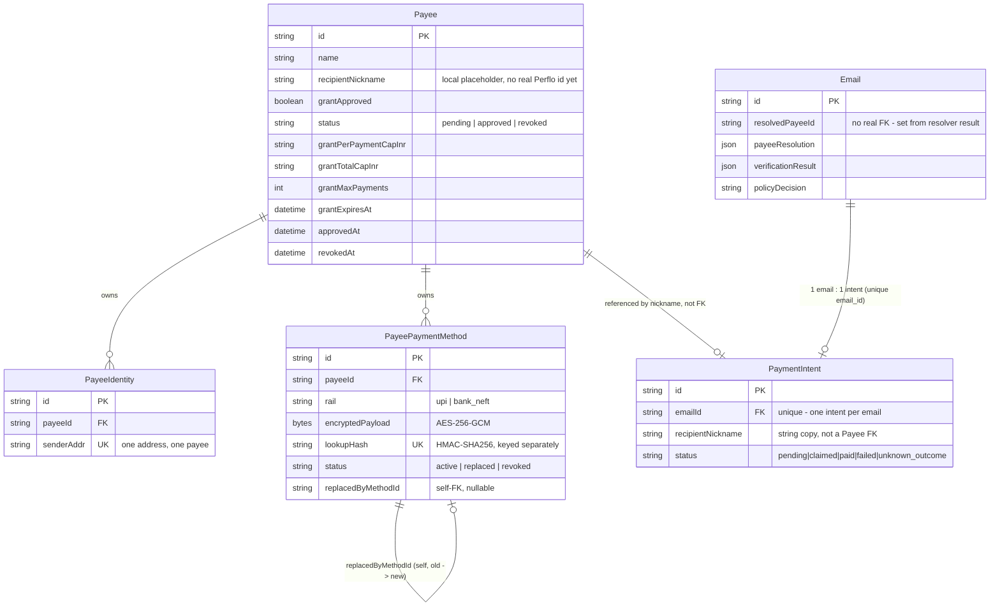
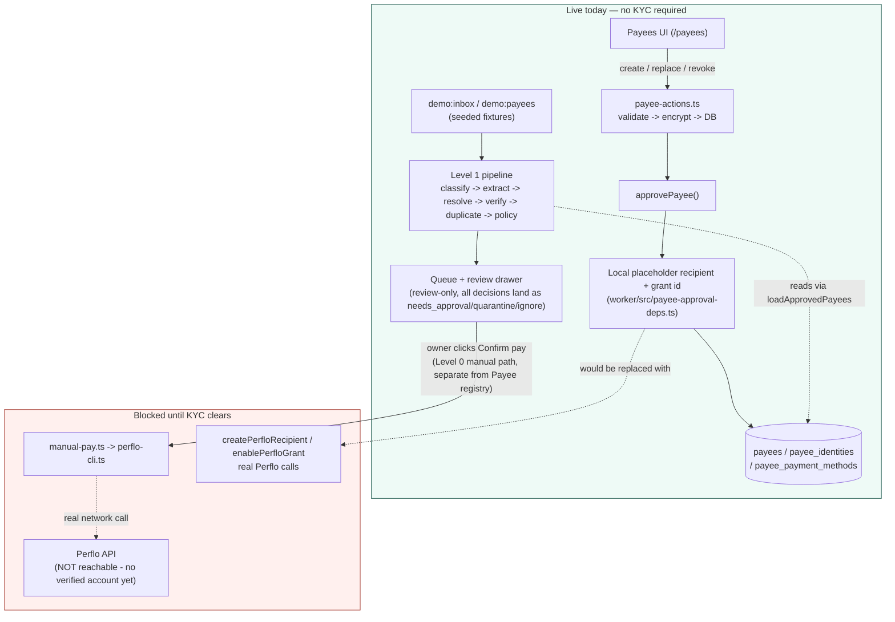

# Perflo AP Agent — Hands-off Handoff

Last verified: 2026-08-30 13:31 IST
Branch: `level1-classifier-llm`
Latest commit: `67e66d9` (`UI: add Queue row review drawer, review-only`) — Payees work below is uncommitted on top of it.

## Current outcome

Level 0 is complete and Level 1 is implemented in **review-only/dry-run mode**. The Payees management screen (server actions, rail lifecycle, masking, demo seed) is now also implemented. The project has been independently checked against the current code, PRD, architecture spec, and Yeshu interview notes.

The latest successful verification ran against local Postgres:

- `pnpm test`: **226/226 passing** across 36 test files (run 3x back to back to confirm no flakiness)
- `pnpm typecheck`: clean
- `pnpm --dir app build`: successful (Turbopack production build), `/payees` route registered alongside `/`
- Prisma: **10 migrations applied; database up to date** — new migration `20260830064402_payee_grant_and_rail_lifecycle` adds grant caps/expiry/status to `Payee` and status/created/replaced/revoked timestamps to `PayeePaymentMethod`
- Manually smoke-tested in a real browser: add-payee inline validation (rejects `billing@gmail.com` as a UPI VPA), successful payee creation with masked rail display, and a real revoke action that flips a rail to `revoked` and hides its action buttons
- No automatic payment is enabled; `AUTO_PAY_MODE`/`auto_pay` remain a policy label only
- No successful real payment has been proven because Perflo KYC is still pending

KYC is an external dependency, not a reason to stop development. Continue building and demonstrating the review flow without connecting the Perflo agent screen or moving real money.

## Conversation and project-state summary

The project began with Level 0 complete and Level 1 implemented as a review-only/dry-run pipeline. The handoff identified the Queue row review drawer as the next task; that drawer is now implemented and tested.

Testing discussions established that real Gmail messages are not required for deterministic coverage. A local seeded demo inbox/test harness is preferred for edge cases; a dedicated Gmail test mailbox can later validate real Gmail/Composio ingestion. Sending controlled emails from the owner is acceptable only in a separate test mailbox, never as the first production test.

The payee discussion clarified that a payee is an internal domain entity, not a third-party integration. Perflo is the third-party payment integration. The database already models `Payee`, `PayeeIdentity`, and encrypted `PayeePaymentMethod` records. A public payee API is not required for the first single-owner version; protected server actions behind a Payees UI are sufficient. A public API can be added later for multiple clients or users.

The agreed testing sequence is: local seeded scenarios → Payees/rail management → full edge-case review → dedicated Gmail ingestion → Perflo KYC/account verification → one small manual payment with reconciliation. KYC is currently an external blocker, not a blocker for local review work.

## Architecture decisions

The money boundary is deterministic:

```text
Gmail/Composio
  → MIME body + PDF text extraction
  → cheap deterministic junk filter
  → classifier (rule-based by default; LLM opt-in, no tools)
  → payment-detail extractor (deterministic by default; LLM opt-in, strict JSON)
  → exact approved-payee resolver
  → deterministic verifier
  → duplicate detector
  → deterministic policy engine
  → review queue
  → manual Perflo payment only
```

The classifier and extractor can read untrusted email data but have no tools, no browser, and no payment permission. Their JSON is validated again by backend code. Prompt injection, malformed output, network failure, and extractor timeout fall back safely.

Payment identifiers follow one validation boundary. Ordinary addresses such as `billing@gmail.com` are not accepted as UPI VPAs. Approved payee rails are encrypted with AES-GCM and looked up with a keyed HMAC; the derived email review summary stores only rail type/count, not raw rail details.

Level 1 writes a reviewable result to the email row: extraction summary, backend used, payee resolution, verification result, duplicate result, policy decision, reasons, and processing time. It never calls the automatic-pay executor. Missing, uncertain, new, or changed information becomes `needs_approval`; injection or hard verifier failures become `quarantine`; obvious non-payables become `ignore`.

### Payee management is a separate boundary, upstream of the pipeline above

The pipeline above only ever *reads* approved payees (`loadApprovedPayees`) — it never creates or edits one. Payee setup is a second, independent surface with its own boundary:

```text
Payees UI → server action → validation → encryption → database
```

This was a deliberate decision, not an incidental implementation choice, for three reasons:

1. **Keeps the money boundary provably one-directional.** If payee approval lived inside the email pipeline, an attacker who could influence classification/extraction output would be one bug away from also influencing who counts as an approved payee. Splitting them means the pipeline can only match against *already-owner-approved* rails; it can never mint a new one.
2. **`approvePayee`'s Perflo calls are still local placeholders, not real ones.** `createPerfloRecipient`/`enablePerfloGrant` (now really implemented in `worker/src/payee-approval-deps.ts`, replacing the test-only mocks that were the *only* implementation before) generate a nickname/grant id locally instead of calling Perflo. This lets the whole Payees screen — creation, replace, revoke, masking, grant caps — be built, tested, and demoed **before** KYC clears, without pretending a real Perflo connection exists. Whoever connects Perflo for real must replace these two functions, not add a new deps object; `approvePayee` itself and everything downstream of it already assumes exactly this shape.
3. **Rails are versioned, not overwritten.** `PayeePaymentMethod` now carries `status`/`createdAt`/`replacedAt`/`revokedAt`/`replacedByMethodId` (new columns — see migration below) specifically so a changed or revoked rail is a new row, not a mutated one. `loadApprovedPayees` filters to `status: "active"` — this is *why* a revoked rail stops resolving invoices, and why a "changed rail" naturally produces `details_changed` → `needs_approval` in the existing policy engine rather than requiring a new rule there.

### Table relationships



Two relationships are deliberately **not** real foreign keys, and that gap is load-bearing, not an oversight:

- `Email.resolvedPayeeId` and `Email.payeeResolution` are set by copying `resolvePayee`'s pure-function result at Level 1 processing time — they describe what the resolver *concluded that run*, not a live join to `Payee`. If a payee is edited after an email was processed, the old email's stored resolution does not retroactively change; only a fresh run (`retryReviewProcessing` / `retryLevel1Processing`) re-resolves it against the current payee state.
- `PaymentIntent.recipientNickname` is a plain string, not a foreign key to `Payee.recipientNickname`. `PaymentIntent` (Level 0's "locked manual pay") and `Payee` (Level 1's payee registry) were built as two independent, not-yet-merged systems — see the `payment_intents` model comment in `schema.prisma` ("a real payee/grant/idempotency-key system... waits for domain-modeling; this is deliberately the small version"). Today a manual payment's recipient nickname is typed by the owner at prepare time; it happens to often match an approved `Payee.recipientNickname`, but nothing enforces that. Wiring `PaymentIntent` to actually require and reference an approved `Payee` is explicitly unfinished work, not yet started.

### Current flow, with KYC still pending

Testing right now is entirely local: one local Postgres instance, seeded demo data (`demo:inbox` / `demo:payees`), and the deterministic classifier/extractor path (an LLM backend is opt-in via `CLASSIFIER_MODE=llm`/`EXTRACTOR_MODE=llm`, only used for local comparison runs so far — no live Gmail traffic has gone through it). Nothing below reaches Perflo's real API:



In plain terms: the Payees screen, the encrypted rail storage, and the whole review pipeline are real and fully testable end-to-end locally — none of it needs Perflo. The only two things actually gated on KYC are (1) `createPerfloRecipient`/`enablePerfloGrant` becoming real calls instead of local placeholders, and (2) the existing manual "Confirm pay" button in the Queue actually reaching Perflo's API instead of failing at connect/login. Everything else — payee creation, rail replace/revoke, resolution, verification, duplicate detection, policy decisions — already runs against real logic and a real (local) database, just never against real money or a real Perflo account. When KYC clears, the work is exactly the two items above, not a rebuild of anything documented here.

## What is complete

- Gmail ingestion, MIME parsing, HTML/plaintext/multipart handling, and restart-safe checkpoint.
- PDF attachment fetch and text extraction with attachment count/size limits.
- Deterministic junk pre-filter for newsletters, calendar messages, and known receipts.
- Six-way classifier: invoice, payment request, reminder, receipt, statement, unrelated.
- Classifier prompt-injection protection, including escaped delimiters, Unicode smuggling, role directives, and exfiltration wording.
- Deterministic extractor for payee, amount/currency, invoice reference, issue/due dates, UPI, and bank details.
- LLM extractor with strict structured output validation and timeout fallback.
- Approved payee model, encrypted payment-method storage, shared rail validation, and real Postgres loader.
- Payee resolver for exact sender/rail matches, new payees, changed details, unknown senders, conflicts, and multiple rails.
- Verifier for authentication alignment, reply-to mismatch, lookalike domains, link mismatch, injection, and rail mismatch.
- Duplicate detector, policy engine, per-payee in-process serialization, and safe auto-pay gate. These are not active payment execution paths yet.
- Queue UI now displays pay amount, invoice reference, field confidence, verifier score, authentication state, rail type, warning, duplicate status, and policy reason.
- Queue row review drawer now displays inert original email text, PDF names/status, all extracted fields and confidence, verifier evidence, duplicate references, all policy reasons, processing/review/payment timeline, and safe owner review actions.
- Review actions persist separately from `PaymentIntent`: approve for review, reject, mark not an invoice, or queue review-only reprocessing. They never execute payment.
- PDF metadata records extraction status where ingestion attempted extraction; unsupported, failed, scanned, or unavailable content remains reviewable.
- Pure rendering tests cover the requested English invoice, multi-line PDF, German text, newsletter price, prompt injection, changed UPI, bank details, and duplicate cases. Payee approval tests cover valid UPI/bank rails and invalid rail rejection.
- Payees management screen: add/list payees with grant caps and expiry, masked rail display, inline form validation mirroring `approvePayee`'s own rules, and explicit-confirmation replace/revoke flows. Replacing or revoking a rail never deletes history — it stamps status/timestamps. A revoked rail can no longer resolve an invoice.
- Real (Postgres-backed) `ApprovePayeeDeps` implementation — the first one; previously only test mocks existed. Perflo recipient/grant creation stays a local placeholder pending KYC.
- Local demo payees (`worker/src/demo-payees.ts`) pairing with the existing demo inbox (`worker/src/demo-inbox.ts`), covering all 9 requested scenarios: normal UPI, bank/NEFT, multiple rails, changed UPI, changed bank account, unknown sender, conflicting sender/rail, revoked rail, and duplicate invoice.
- Small commits cover validation, LLM extraction, encrypted payee loading, pipeline persistence, queue UI, the review drawer, and payee management.

## Exact next task

The Payees management screen described below is implemented and tested. **Do not reintroduce it as the next task.** The next task is to move down the agreed testing sequence:

1. Full edge-case review pass over the demo scenarios in `worker/src/demo-inbox.ts` (`--list` shows all names) against the demo payees in `worker/src/demo-payees.ts` — confirm every documented case (missing fields, unsupported currency, scanned/corrupt PDFs, lookalike domains, Reply-To mismatch) still routes exactly where the PRD says, now that real approved payees exist to resolve against.
2. Only after that: a dedicated Gmail test mailbox for real ingestion validation (not the owner's real inbox — see "Do not do" below).
3. Only after KYC clears: connect Perflo, verify identity, and reconcile one small manual payment.

Do not connect the Perflo "Connect an agent" screen or attempt a real payment to continue either of these — both are local-only.

## Files changed and review map (Payees management)

Review these files before extending the payee system further:

- `app/app/payees/page.tsx` — server component; the only place that decrypts a rail, purely to compute a masked display string. Raw plaintext never leaves this function.
- `app/app/payee-form.tsx`, `app/app/payee-rail-row.tsx` — client components; inline validation before submit, explicit confirm-checkbox before replace/revoke (no native `confirm()` dialogs — those aren't reliably testable/automatable).
- `app/app/payee-form-model.ts` and `.test.ts` — pure validation (mirrors `approvePayee`'s own rules per-field) and masking (`maskRailValue`), unit tested with no DB.
- `app/app/payee-actions.ts` and `.test.ts` — the three server actions (`createPayeeAction`, `replaceRailAction`, `revokeRailAction`); structurally asserts it never imports `perflo-cli`/`manual-pay`/`payment-claim`.
- `worker/src/payee-approval-deps.ts` and `.integration.test.ts` — the first real (Postgres-backed) `ApprovePayeeDeps` implementation. `createPerfloRecipient`/`enablePerfloGrant` are **local placeholders** (a slugified nickname, a local grant id) — they deliberately do not call Perflo; KYC is still pending. Replace them for real once Perflo is connected.
- `worker/src/payee-rail-lifecycle.ts` and `.integration.test.ts` — `replacePaymentRail`/`revokePaymentRail`. Replacing creates a new `active` row and marks the old one `replaced` (linked via `replacedByMethodId`); revoking marks `revoked`. Neither ever deletes a row.
- `worker/src/payee-store.ts` — `loadApprovedPayees` now filters `paymentMethods` to `status: "active"` only; a revoked rail can no longer resolve an invoice (see the regression test in `payee-store.integration.test.ts`).
- `worker/src/payee-crypto.ts` — added `toPrismaBytes` (Buffer → Prisma's `Uint8Array<ArrayBuffer>` BYTEA input), shared by every write path instead of each caller reimplementing the conversion.
- `worker/src/demo-payees.ts` — demo payees: normal UPI, bank/NEFT, multiple rails, a payee whose rail collides with another sender's identity (for `identity_method_conflict`), and a payee with a revoked rail. Rail specs are encrypted **inside** `seedDemoPayees()`, not at module load — `PAYEE_ENCRYPTION_KEY` is often overridden by a caller (a test's `beforeEach`) after this module is imported, and import side effects run first.
- `worker/src/demo-inbox.ts` — fixed a real bug: its own `deps` object never wired `loadApprovedPayees`, so "changed-upi"/"unknown-sender"/etc. could never actually resolve against any approved payee. Added a `conflicting-sender-rail` scenario. Run `pnpm demo:inbox --list` for all scenario names.
- `worker/src/demo-scenarios.integration.test.ts` — proves demo payees + demo inbox actually resolve to the status their names promise (this is the regression test for the `loadApprovedPayees` bug above).
- `packages/db/prisma/schema.prisma` + migration `20260830064402_payee_grant_and_rail_lifecycle` — `Payee` gains `status`, `grantPerPaymentCapInr`, `grantTotalCapInr`, `grantMaxPayments`, `grantExpiresAt`, `approvedAt`, `revokedAt`; `PayeePaymentMethod` gains `status`, `createdAt`, `replacedAt`, `revokedAt`, `replacedByMethodId`.
- `package.json` — added `demo:payees` script (`--reset`, `--reseed`).
- `.claude/launch.json` — added so this session's browser tool could preview the app; harmless to keep or delete.

Two Turbopack-specific fixes worth knowing about if this bites again: `import type` is erased and never reaches the bundler, but the value imports (`./payee-crypto.js`, `./payment-method-validation.js`) that several worker files use for real Node/`tsx` ESM resolution fail to resolve under Next's Turbopack bundler. `payee-approval.ts`, `payee-approval-deps.ts`, `payee-rail-lifecycle.ts`, and `payee-store.ts` now use extensionless relative imports for the value imports specifically — safe because none of these four files are ever loaded via raw `tsx`/Node ESM (only via Next/Turbopack or vitest, both of which resolve extensionless fine). Do **not** apply this change to files that worker/index.ts or the demo/CLI scripts load directly (e.g. `ingest.ts`, `level1-pipeline.ts`) — those still need the `.js` suffix for `tsx`'s Node ESM resolution.

## Files changed and review map (Queue row review drawer)

- `app/app/review-drawer.tsx` — interactive drawer, safe text-only email display, owner actions, Escape/focus return.
- `app/app/review-drawer-model.ts` and `app/app/review-drawer-model.test.ts` — pure review projection, confidence fallbacks, evidence/timeline mapping, and eight requested demo cases.
- `app/app/page.tsx` — serializes database rows into the drawer and exposes the row-review trigger; also now links to `/payees`.
- `app/app/actions.ts` — review-state persistence and retry queue; existing manual payment actions remain separate.
- `app/app/globals.css` — drawer layout, responsive states, focus-visible styling, action controls, and the new payee-form/rail-row styles.
- `packages/db/prisma/schema.prisma` and `packages/db/prisma/migrations/20260830114500_review_actions/migration.sql` — `reviewStatus`/`reviewedAt` persistence.
- `packages/db/client.ts` — exports Prisma JSON-null support for safe retry clearing.
- `worker/src/ingest.ts` — currency confidence, explicit PDF extraction metadata, shared Level 1 processing, and pending review reprocessing.
- `worker/src/index.ts` — worker processes rows queued for another review-only pass.
- `worker/src/ingest-pdf.test.ts` — extracted/failed PDF status assertions.
- `worker/src/payee-approval.test.ts` — payee UPI/bank approval contract tests.
- `README.md` and `tests/README.md` — current commands, status, test count, and next work.

More information is in `.env.example` for safe local configuration, `packages/db/prisma/schema.prisma` for persistence boundaries, `worker/src/payee-approval.ts` for owner approval semantics, `worker/src/payment-method-validation.ts` for rail validation, and the test files beside each worker module. The README references `docs/PRD_PERFLO_AP_AGENT_V0.md`, but that path is not present in the current repository file listing; treat this handoff and the executable tests as the current implementation record until the PRD is restored.

## Work that can proceed while KYC is pending

- Run classifier/extractor in review-only mode and compare deterministic versus LLM results.
- Add Sync Now and the global Pause control.
- Add red-team `.eml` fixtures and CI coverage for injection, changed rails, German/multiline PDFs, and duplicate invoices.
- Add OCR/image-only PDF detection that routes to review.
- Add event/audit timeline storage.
- Document the supported-currency boundary: current structured extraction is INR/USD; unsupported currencies require review.
- Full edge-case pass over the demo scenarios (see "Exact next task" above).

## Work blocked or gated by KYC/Perflo access

After KYC clears, connect/login to Perflo, verify the connected account identity, and make one small manual payment. Confirm it in Perflo Activity and test the error/retry path. Do not enable auto-pay immediately.

Before any automatic payment, finish:

- Perflo recipient/grant approval UI and real grant persistence.
- Reconciliation for a crash after Perflo accepts a payment but before the database update.
- Global Pause and Sync Now behavior.
- Shared database/distributed lock if more than one worker will run.
- Persistent duplicate/content-hash checks and Gmail labels.
- x402/browser link verification and rail-level account-name verification.
- T-7 through T-25 real or reproducible acceptance tests, with no payment in the red-team cases.

## Do not do

- Do not connect the Perflo “Connect an agent” screen merely to continue Level 1; it is not required for this review-only work.
- Do not put API keys in chat, prompts, commits, or screenshots.
- Do not treat an LLM confidence score as authorization.
- Do not display or copy raw bank/UPI details into derived review JSON.
- Do not enable `AUTO_PAY_MODE` or make a real payment until the reconciliation and approval controls are proven.

## Handoff commands

```bash
pnpm test
pnpm typecheck
pnpm --dir app build
pnpm --dir packages/db exec prisma migrate status
git log --oneline -8
```

The PRD remains the desired end state. This handoff records what the code actually does today so another AI must verify the repository before extending it.
